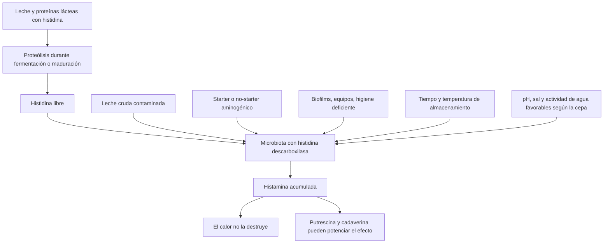

# Lácteos de vaca, histamina y DAO

## Resumen ejecutivo

La conclusión práctica es bastante clara: **la leche de vaca fresca o recién abierta suele ser un lácteo de bajo riesgo para sensibilidad a histamina o déficit/inhibición de DAO; el problema real se concentra en los lácteos fermentados y, sobre todo, en los quesos curados o muy madurados**. En leche pasteurizada y UHT, los estudios disponibles encuentran concentraciones bajas de histamina, habitualmente en el rango de décimas de mg/L a alrededor de 1 mg/L; aun así, hay outliers cuando el producto está más tiempo abierto o cuando existe contaminación/higiene deficiente. citeturn11view5turn41view0turn19view0turn33search7

Los **quesos curados, semicurados, azules y de larga maduración** son, con diferencia, el grupo más preocupante: hay estudios con hallazgos desde decenas de mg/kg hasta más de 1000 mg/kg, y series comerciales en España en las que aproximadamente **un tercio** de los quesos analizados superó **200 mg/kg**, con algunos productos por encima de **500 mg/kg**. Además, los quesos elaborados con **leche cruda** y/o con **maduración prolongada** tienden a concentrar más histamina. citeturn20search0turn21search2turn30search2turn30search18

**Yogur, kéfir y otras leches fermentadas** se sitúan en una zona intermedia: no son uniformemente “malos”, pero sí **variables**. En una serie española reciente, el yogur mostró histamina cuantificable entre **0,82 y 17,16 mg/kg**, mientras que el kéfir tuvo histamina baja en esa muestra concreta, pero con **carga total de aminas biógenas muy superior** por putrescina y cadaverina; la literatura previa describe valores incluso mayores para ambos productos. En pacientes con baja actividad DAO, eso importa porque **no solo cuenta la histamina**: otras aminas biógenas pueden competir por las vías de degradación y potenciar la toxicidad. citeturn18view0turn18view3turn17view3turn19view6turn13view0

No encontré evidencia clínica sólida de que **la leche de vaca, por sí misma y fuera del contexto de alergia**, sea un **inhibidor demostrado de DAO** o un **liberador universal de histamina**. Algunas tablas dietéticas la incluyen como posible “histamine liberator”, pero las revisiones recientes subrayan que **el mecanismo no está aclarado y la evidencia es inconclusa**. En cambio, sí están mejor apoyados como inhibidores o moduladores negativos de la degradación de histamina el **alcohol**, ciertos **fármacos** y el exceso de **otras aminas biógenas**. citeturn37view0turn37view2turn37view3turn39search10turn40view0

Para la práctica clínica, el patrón más razonable es: **priorizar lácteos frescos, poco procesados y no fermentados; reservar o evitar temporalmente los fermentados; y considerar los quesos curados como el grupo de mayor riesgo**. El enfoque debe ser individual, con **restricción breve**, **reintroducción escalonada** y **diario de síntomas**, porque el valor sérico de DAO por sí solo no es concluyente. citeturn11view0turn12view2turn36view0turn11view9

## Histamina, DAO y mecanismos relevantes

La histamina es una **amina biógena** presente en alimentos y también producida en el organismo. En comida, su vía principal de formación es la **descarboxilación bacteriana de la histidina**. En el intestino, la enzima **DAO** actúa como barrera frente a la histamina ingerida; la **HNMT** también participa en su metabolismo, pero la DAO es la pieza más citada para la fracción alimentaria. Cuando la degradación intestinal es insuficiente, la histamina absorbida puede contribuir a síntomas digestivos y extraintestinales inespecíficos. citeturn40view0turn12view1turn37view2

El problema clínico es que los síntomas son **poco específicos** —dolor abdominal, diarrea, cefalea, rubor, prurito, rinorrea, mareo, taquicardia— y se solapan con otras entidades. La guía alemana de la entity["organization","AWMF","german medical societies"] insiste en que la sospecha mejora cuando hay una **asociación temporal con la ingesta**, típicamente desde **minutos hasta 4 horas**, y recuerda que el diagnóstico diferencial incluye, entre otros, **malabsorción de lactosa o fructosa**, enfermedad celíaca, enfermedades inflamatorias intestinales, rinitis/asma no alérgicos y mastocitosis. citeturn12view0turn11view0

Sobre la DAO, la misma guía y revisiones posteriores coinciden en que **la actividad sérica de DAO no es un biomarcador diagnóstico concluyente**. De hecho, un ensayo cruzado aleatorizado reciente en pacientes con sospecha de intolerancia a histamina observó que la **dieta reducida en histamina** sigue siendo la herramienta diagnóstica más útil, mientras que los cambios en DAO sérica **no se relacionaron claramente con el tipo de dieta**. citeturn11view0turn12view1turn36view0

Además, el riesgo no depende solo de la histamina aislada. El informe del comité científico de la entity["organization","Agencia Española de Seguridad Alimentaria y Nutrición","spain food safety agency"] y otras revisiones recuerdan que **putrescina y cadaverina** pueden **potenciar** los efectos adversos de la histamina y **entorpecer su detoxificación**, algo especialmente relevante en fermentados donde la suma de aminas puede ser alta aunque la histamina sola no lo sea. Del mismo modo, el alcohol y algunos medicamentos pueden empeorar el escenario en personas sensibles. citeturn13view0turn37view2turn40view0

## Revisión de la evidencia por producto

**Leche de vaca pasteurizada y UHT.** La evidencia analítica disponible la sitúa en la zona baja. En 41 leches de vaca estudiadas en 2024, la histamina fue siempre baja: al abrir el envase, la mediana fue **0,56 mg/L** en pasteurizada y **0,74 mg/L** en UHT; a los 7 días abierta, **0,77 mg/L** y **0,85 mg/L**, respectivamente, con máximos alrededor de **1,10 mg/L**. El mismo trabajo encontró valores algo mayores en UHT, en leches semidesnatadas/desnatadas y con más tiempo tras la apertura, pero sin acercarse a las concentraciones típicas de los fermentados problemáticos. citeturn11view5turn41view0

Un segundo estudio español analizó **37 leches**, **23 yogures** y **14 kéfires**. En la leche, la mayoría de las muestras no contenían aminas detectables; la histamina apareció solo en dos muestras y fue cuantificable únicamente en una, un caso atípico de leche UHT desnatada con **6,239 mg/L** de histamina y **40,112 mg/L** de aminas totales. Es importante subrayar que este fue un **outlier**, no el patrón dominante. Otro estudio turco en leche pasteurizada y tratada a alta temperatura halló una media de solo **0,18 mg/L**. citeturn19view0turn19view5turn41view1turn33search7

**Leche cruda.** La revisión de conjunto sobre histamina en lácteos resume que en **leche cruda fresca** la concentración suele ser baja, pero añade una advertencia importante: la **microbiota de partida** y la ausencia de tratamiento térmico hacen el producto **menos predecible**, sobre todo si hay contaminación por bacterias aminogénicas o si falla la cadena de frío. La experiencia en quesería confirma que la leche cruda favorece mayor carga microbiana y más aminas durante la maduración posterior. citeturn31view0turn30search2turn30search6

**Quesos frescos o no madurados.** La mejor evidencia comparativa indica que los **quesos no madurados** tienen menos aminas que los madurados. La revisión de Moniente y otros resume que leche, yogur, requesón/cottage y quesos no maduros suelen moverse en el rango de **miligramos a decenas de mg/kg**; y un trabajo clásico de distribución de aminas en queso concluyó que **todas las aminas fueron menores en quesos no madurados que en los madurados**, lo que apoya considerarlos relativamente mejor tolerados en sensibilidad a histamina, aunque no equivalga a garantía universal. citeturn32view2turn28search0turn27search17

**Quesos curados, semicurados, azules y de larga maduración.** Aquí la evidencia es fuerte y consistente. Un estudio de **80 quesos** encontró histamina en el **41,25 %** de las muestras, con valores desde **20 mg/kg** hasta **más de 1000 mg/kg**, y los niveles más altos en quesos de **larga maduración** hechos con **leche cruda**. En otro estudio español de **39 tipos de queso**, el **51,2 %** contenía histamina detectable; cerca de **un tercio** superaba los **200 mg/kg**, y **dos** quesos excedían **500 mg/kg**. Las autoridades británicas recuerdan además que, tras el pescado, el **queso —especialmente el madurado— es uno de los alimentos más vinculados a intoxicación por histamina**. citeturn20search0turn21search2turn14view1turn30search18

La maduración y el almacenamiento empeoran la situación. En quesos de maduración enzimática almacenados a distintas temperaturas y tiempos, el contenido total de histamina fue aproximadamente **el doble a 22 °C que a 4 °C**, con un máximo de **730,47 mg/kg** en Gorgonzola Piccante. Además, la histamina no se distribuye homogéneamente dentro del queso: tiende a acumularse más en el **núcleo central** y en zonas **más húmedas, saladas y menos oxidadas**, lo que explica por qué un mismo queso puede “pegar” distinto según la porción analizada o consumida. citeturn22search5turn35search22turn22search6

**Yogur.** En la serie española de 2023, el yogur mostró una incidencia de aminas claramente superior a la leche. La histamina fue cuantificable en **5** muestras y osciló entre **0,82 y 17,16 mg/kg**; el mayor contenido total de aminas fue **35,07 mg/kg**, por combinación de histamina y putrescina. La misma publicación resume literatura anterior con un rango de histamina en yogur desde **no detectable** hasta **65,18 mg/kg**. En resumen: el yogur no está al nivel de los quesos curados, pero para un paciente con baja actividad DAO **no es un alimento “neutro”**. citeturn18view0turn18view1turn18view3

**Kéfir.** El kéfir fue el producto más variable del estudio español: en esa serie, la histamina fue cuantificable solo en **2** muestras (**0,831 y 1,211 mg/kg**), pero la **carga total de aminas biógenas** llegó a **79,66 mg/kg**, con mucha participación de **cadaverina** y **putrescina**. La revisión bibliográfica del mismo artículo recoge valores previos de histamina en kéfir hasta **30,82 mg/kg**. Por tanto, un kéfir puede parecer “bajo en histamina” en una medición concreta y seguir siendo problemático por el **conjunto de aminas** y por lo **difícil que es predecir sus lotes y fermentaciones**. citeturn17view3turn17view5turn18view3turn13view0

**Leche fermentada y derivados similares.** La lógica microbiológica y las revisiones de proceso son coherentes: a medida que aumenta la **fermentación**, aumenta la probabilidad de formar histamina y otras aminas si las cepas presentes son aminogénicas. Existen métodos analíticos para leche ácida, leche fermentada, fermentados de crema y buttermilk, pero los estudios comparativos modernos y clínicamente utilizables son mucho menos abundantes que para queso, yogur o kéfir. Por eso, el juicio aquí debe ser **prudente**: riesgo mayor que la leche fresca, menor que el queso curado, con mucha dependencia del producto concreto. citeturn26view0turn32view2turn31view0

**Mantequilla.** La evidencia directa es escasa, pero no inexistente. Un estudio reciente en mantequilla mostró que, durante el almacenamiento en frío, la formación de aminas biógenas aumentaba en los controles y podía reducirse en **44–61 %** con estrategias que frenaban el deterioro microbiano/oxidativo. Esto sugiere dos cosas: primero, que la **mantequilla fresca no es un gran reservorio basal** de histamina; segundo, que **el almacenamiento prolongado y el deterioro** sí pueden aumentar la carga amínica. La extrapolación a sensibilidad a histamina debe hacerse con cautela porque faltan datos específicos de histamina clínica y de tolerancia en pacientes. citeturn34view0

**Nata o crema.** Para nata fresca no fermentada, la evidencia directa sobre histamina es sorprendentemente limitada. Por composición y proceso, se parece más a la leche que al queso curado; pero en cuanto la nata es **fermentada** o “acidificada”, entra en la lógica de los lácteos fermentados. Por tanto, la nata fresca pasteurizada parece **baja-moderada en riesgo** por inferencia, mientras que la **nata agria o fermentada** debe tratarse como producto de riesgo superior. citeturn26view0turn31view0

**Suero de leche.** Aquí la evidencia es claramente insuficiente. Existen trabajos que incluyen **whey/suero** en la cadena de elaboración del queso, pero pocos publican rangos modernos y clínicamente útiles de histamina en suero líquido de consumo, y menos aún en **concentrados o polvos de proteína de suero**. A día de hoy, la clasificación del suero debe considerarse **provisional** y con **incertidumbre alta**. citeturn25view3turn29search5

**Helados lácteos.** No encontré estudios analíticos robustos y recientes que permitan cuantificar bien el riesgo de histamina del **helado lácteo natural** como categoría propia. Por inferencia de proceso, un helado simple de leche/nata sin fermentación debería comportarse más como leche/nata que como yogur o queso; pero en la práctica, coberturas, cacao, frutas cítricas, trozos fermentados o aromas pueden importar más que la base láctea. La evidencia, aquí, es **muy débil** y obliga a personalizar. citeturn37view0turn37view3

**¿La leche de vaca libera histamina o inhibe DAO?** La respuesta rigurosa es: **no hay prueba convincente de que la leche de vaca lo haga de forma generalizable**. Es cierto que algunas tablas dietéticas la colocan entre los posibles “histamine liberators”, pero las revisiones más recientes dicen expresamente que el **mecanismo no está dilucidado** y que la evidencia es **inconclusa**. En cambio, la inhibición de DAO está bastante mejor documentada para **alcohol**, **otras aminas biógenas** y **ciertos fármacos**. Fuera del contexto de alergia a proteínas de leche —que aquí no estamos discutiendo—, hablar de la leche como “liberador demostrado” o “inhibidor de DAO” sería exagerar el estado real de la evidencia. citeturn37view0turn37view2turn37view3turn39search10turn40view0

## Factores que aumentan la histamina en los lácteos

En lácteos, la histamina aumenta cuando coinciden **sustrato**, **microorganismos adecuados** y **condiciones favorables**. El sustrato llega por la **proteólisis**: la maduración libera histidina a partir de las proteínas lácteas. Los microorganismos son bacterias y, a veces, levaduras/mohos con **histidina descarboxilasa**. Y las condiciones favorables incluyen tiempo, temperatura, acidez, actividad de agua, sal, contaminación ambiental y competencia microbiana. El calor culinario no resuelve el problema una vez la histamina ya se ha formado, porque las aminas biógenas son **termoestables**. citeturn31view0turn14view1

La figura resume lo que muestran las revisiones y estudios de proceso: **fermentación**, **maduración**, **almacenamiento prolongado**, **contaminación bacteriana** y ciertas condiciones de elaboración favorecen la acumulación; por eso el queso madurado es el escenario clásico, mientras que la leche fresca suele estar mucho más abajo en riesgo. También por eso la **pasteurización** reduce el riesgo aguas abajo en queso: disminuye la carga microbiana inicial, aunque no elimine la histamina ya formada. citeturn31view0turn30search2turn30search1turn22search5

Un detalle práctico importante es que la histamina puede aparecer en **“hotspots”** y distribuirse de forma heterogénea, especialmente en queso. Eso explica por qué dos porciones del mismo queso o dos lotes muy parecidos pueden resultar clínicamente distintos. En leche abierta, aunque el nivel siga siendo bajo, el simple paso de **24–48 horas** y, con más claridad, de **7 días**, se asocia a incrementos mensurables. citeturn22search6turn41view0

## Clasificación práctica del riesgo

La escala siguiente es **específica para personas con sensibilidad a histamina o con actividad DAO reducida/inhibida**: **0 = habitualmente inocuo**, **1 = bajo riesgo pero vigilar**, **2 = riesgo moderado/variable**, **3 = alto riesgo o potencialmente peligroso**. No expresa riesgo para la población general. Se basa en cuatro ejes: **contenido de histamina**, **otras aminas biógenas**, **variabilidad entre lotes** y **calidad de la evidencia**. Las categorías bajas pueden empeorar si se combinan con alcohol, fármacos inhibidores de DAO o varias fuentes de aminas en la misma comida. citeturn13view0turn37view2

El gradiente del diagrama sigue el patrón mejor apoyado por la literatura: **cuanto más fermentación, maduración, tiempo y variabilidad microbiológica**, mayor riesgo. citeturn31view0turn14view1turn21search2

| Producto | Riesgo | Justificación resumida | Grado de incertidumbre |
|---|---:|---|---|
| Leche pasteurizada recién abierta | 0 | Histamina muy baja en estudios; suele ser el lácteo de mejor perfil | Baja |
| Leche UHT recién abierta | 0 | Similar a pasteurizada; algo más alta de media, pero aún baja | Baja |
| Leche cruda | 1 | Basalmente baja si es muy fresca, pero menos predecible por microbiota y cadena de frío | Media |
| Queso fresco / requesón / cottage | 1 | Mejor perfil que los quesos madurados; siguen existiendo lotes con aminas en rango bajo–moderado | Media |
| Yogur | 2 | Fermentado y bastante variable; algunos lotes alcanzan histamina relevante para sensibles | Media |
| Kéfir | 2 | Muy variable; la histamina puede ser baja, pero otras aminas pueden ser altas | Media-alta |
| Leche fermentada / buttermilk / nata fermentada | 2 | Riesgo intermedio por fermentación, con pocos datos directos actuales por subproducto | Alta |
| Nata fresca no fermentada | 1 | Probablemente baja-moderada; el problema sube si es agria/fermentada | Alta |
| Mantequilla | 1 | Basalmente baja, pero el deterioro y el almacenamiento pueden aumentar aminas | Alta |
| Suero de leche | 1 | Evidencia insuficiente; riesgo probablemente inferior a queso curado, pero muy incierto | Alta |
| Helado lácteo natural | 1 | Evidencia directa escasa; la base parece de bajo riesgo, pero las formulaciones mandan | Alta |
| Queso semicurado / curado / añejo / azul | 3 | Grupo con evidencia más fuerte de acumulación alta y de intoxicaciones | Baja |

La base documental del cuadro es fuerte para **leches**, **quesos curados**, **quesos frescos**, **yogur** y **kéfir**; es claramente más débil para **nata**, **mantequilla**, **suero** y **helados**, donde la clasificación es más inferencial y debe interpretarse con modestia. citeturn11view5turn41view1turn21search2turn20search0turn34view0turn25view3

## Recomendaciones prácticas para pacientes sensibles a histamina o con DAO baja

La estrategia más útil no es “quitar todos los lácteos”, sino **ordenarlos por riesgo**. En la fase de estabilización, suele tener más sentido retirar primero **quesos curados**, **yogures**, **kéfires** y otros **fermentados**, mientras se valora si la **leche pasteurizada/UHT** o un **queso fresco** son realmente problemáticos para ese paciente en concreto. Esto es coherente con la guía de la AWMF, que propone una fase breve de restricción/optimización seguida de reintroducción dirigida, y con la evidencia más reciente que desaconseja dietas excesivamente largas y rígidas. citeturn41view2turn36view1turn11view9

En la práctica, la reintroducción debería hacerse **de uno en uno**, empezando por las opciones de **riesgo más bajo**. Un orden razonable es: **leche pasteurizada o UHT recién abierta**, luego **queso fresco**, después **nata o mantequilla frescas**, y dejar para el final **yogur/kéfir** y, por último, **quesos curados**. Conviene usar **porciones pequeñas al inicio**, repetir el mismo alimento en condiciones parecidas y registrar síntomas junto con **estrés**, **menstruación**, **medicación**, **alcohol** y otras ingestas altas en aminas. citeturn41view2turn36view1turn37view2

El manejo del **almacenamiento** importa mucho. Para un paciente sensible, es mejor comprar envases pequeños, mantener el producto bien refrigerado, minimizar el tiempo abierto y evitar lácteos que hayan pasado horas a temperatura ambiente. En queso, el riesgo aumenta con **maduración**, **temperatura** y **tiempo**; en leche abierta, los incrementos son menores pero medibles. La frase útil es: **cuanto más fresco y menos fermentado, mejor**. citeturn41view0turn22search5turn31view0

El **etiquetado** puede ayudar aunque no mida histamina. Como regla, son señales de menor riesgo expresiones como **“pasteurizada”, “UHT”, “fresco”**, mientras que palabras como **“fermentado”, “cultivos”, “kéfir”, “madurado”, “curado”, “añejo”, “azul”, “ahumado”** o **“leche cruda”** apuntan a más prudencia. En helados y postres, a veces el problema no es la base láctea sino añadidos como **cacao/chocolate**, **cítricos** o frutas concretas que algunas guías de dieta baja en histamina sitúan entre alimentos a vigilar. citeturn31view0turn37view0turn37view3

Si un paciente reacciona llamativamente a **leche normal** pero no a otros lácteos o a otros alimentos ricos en histamina, conviene no forzar una explicación por histamina. En ese escenario hay que volver al diferencial: **lactosa**, otros trastornos funcionales intestinales, enfermedad celíaca, patología mucosa, mastocitosis o interacciones farmacológicas. La propia guía de la AWMF insiste en que el diagnóstico debe basarse en síntomas, temporalidad y exclusión razonable de otras causas, no en una sola analítica de DAO. citeturn12view0turn11view0turn36view0

Respecto a **DAO exógena** en suplemento, puede ser un apoyo en algunos pacientes, pero la evidencia sigue siendo heterogénea y persisten dudas sobre formulaciones, actividad real y criterios diagnósticos. Si se usa, debe verse como un **complemento** y no como licencia para consumir sin control quesos curados o fermentados problemáticos. citeturn36view1turn37view2

## Referencias seleccionadas

**Guías y documentos oficiales**

- **entity["organization","Agencia Española de Seguridad Alimentaria y Nutrición","spain food safety agency"]**. Informe del Comité Científico sobre aminas biógenas y riesgo alimentario; útil para toxicidad, sinergias entre aminas y contextualización regulatoria. citeturn11view2turn13view0turn13view1
- **entity["organization","Autoridad Europea de Seguridad Alimentaria","eu food authority"]**. Scientific Opinion on risk-based control of biogenic amine formation in fermented foods; fuente central para la ARfD de histamina y el foco en fermentados. citeturn14view1turn13view0
- Guía S1 de la **entity["organization","AWMF","german medical societies"]** sobre manejo de reacciones sospechadas a histamina ingerida; muy útil para diagnóstico práctico, valor limitado de DAO sérica y estrategia de restricción-reintroducción. citeturn11view0turn12view2
- Documento británico de evaluación de riesgo sobre histamina en queso; útil para termoestabilidad, relevancia de queso madurado y gestión del riesgo. citeturn14view0turn14view1

**Artículos originales clave**

- **Szczyrba et al., 2024**. Histamine concentration in selected types of cow’s milk taking into account storage conditions: estudio comparativo de leches UHT y pasteurizadas durante almacenamiento tras apertura. citeturn11view5turn41view0
- **Moniente et al., 2023**. Análisis de 37 leches, 23 yogures y 14 kéfires con cuantificación directa de histamina, tiramina, putrescina y cadaverina. citeturn41view1turn19view0turn18view0
- **Ladero et al., 2008**. Estudio de 80 quesos con histamina entre 20 y >1000 mg/kg y asociación con quesos de larga maduración/leche cruda. citeturn20search0turn20search1
- **Botello-Morte et al., 2022**. Encuesta de 39 quesos comercializados en España; aproximadamente un tercio >200 mg/kg y dos >500 mg/kg. citeturn21search2
- **Madejska et al., 2018**. Almacenamiento de quesos a distintas temperaturas y tiempos; evidencia directa del papel de la temperatura en la acumulación. citeturn22search5turn35search22
- **Novella-Rodríguez et al., 2004**. Evaluación de aminas biógenas y recuentos microbianos en quesos de cabra elaborados con leche cruda frente a pasteurizada. citeturn30search2turn30search8

**Revisiones de alto valor**

- **Comas-Basté et al., 2020**. Histamine Intolerance: The Current State of the Art; excelente síntesis sobre histamina, DAO, HNMT y bases diagnósticas. citeturn40view0
- **Moniente et al., 2021**. Histamine accumulation in dairy products: revisión específica sobre microbiología, causas y soluciones en lácteos. citeturn31view0
- **Jackson et al., 2025**. Evidence for Dietary Management of Histamine Intolerance; útil para interpretar críticamente dietas bajas en histamina, alimentos “liberadores” y papel de DAO. citeturn36view1turn37view3
- **Van Odijk et al., 2024**. Ensayo cruzado aleatorizado sobre dieta baja en histamina vs dieta mixta y medición de DAO sérica; muy relevante para la práctica clínica. citeturn36view0