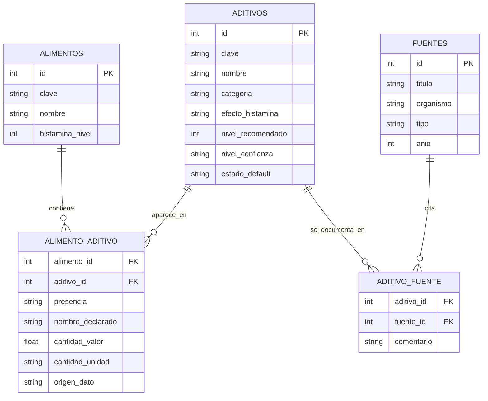

# Integrar conservantes y aditivos en una base de datos de alimentos orientada a histamina

## Resumen ejecutivo

He priorizado dictámenes de la entity["organization","Autoridad Europea de Seguridad Alimentaria","parma italy"], la entity["organization","Administración de Alimentos y Medicamentos de Estados Unidos","silver spring maryland us"] y el trabajo conjunto de la entity["organization","Organización Mundial de la Salud","geneva switzerland"] con la entity["organization","Organización de las Naciones Unidas para la Alimentación y la Agricultura","rome italy"] en JECFA, además de estudios primarios de provocación, urticaria y mastocitos indexados en PubMed.

La conclusión práctica es que **sí merece mucho la pena** añadir un módulo de aditivos/conservantes, pero **no** conviene mezclarlo con el valor de histamina intrínseca del alimento. La mayor parte de las reacciones a aditivos descritas en clínica son **hipersensibilidad no IgE/pseudoalergia** o activación mastocitaria directa, y en pruebas de provocación bien controladas la sensibilidad global a aditivos parece **poco frecuente**; por eso la base de datos debe almacenar **dos ejes separados**: `histamina del alimento` y `reactividad a aditivos`. citeturn1search3turn23search6

Si tu objetivo es un sistema práctico y conservador para personas con sensibilidad a histamina, los grupos con **mejor señal para evitar por defecto** son **sulfitos**, **benzoatos** y, en un segundo escalón, **BHA/BHT**. En sulfitos la señal es la más robusta: hay advertencias regulatorias específicas, provocaciones orales positivas en personas susceptibles y datos experimentales de liberación/degranulación mastocitaria. Benzoatos y BHA/BHT tienen una evidencia menos sólida que los sulfitos, pero suficientemente consistente como para justificar una bandera de riesgo real en un sistema orientado a síntomas. citeturn20view1turn11search23turn1search7turn10search14turn10search0turn15search1turn15search0

Los compuestos que yo pondría en **“cautela” y no en “prohibido” para un perfil estándar** son **glutamatos/MSG**, **nitritos/nitratos** y **sorbatos**. En los tres casos hay señal biológica o clínica aislada, pero la evidencia histamínica es **más débil, contradictoria o indirecta**. En cambio, **ácido ascórbico/ascorbatos** y **propionatos** encajan mejor como **permitidos por defecto**, porque la literatura disponible apunta a neutralidad o incluso a un efecto antihistamínico/anti-degranulación experimental; **EDTA** lo trataría como **bajo riesgo provisional**, con etiqueta explícita de **evidencia insuficiente para histamina**. citeturn19view12turn12search0turn12search3turn3search1turn5search1turn4search3turn4search18turn6search13turn35search0turn35search1turn26search5

Mi recomendación de diseño es **modelar por familias primero** —sulfitos, benzoatos, glutamatos, nitritos/nitratos, sorbatos, propionatos, ascorbatos, BHA/BHT y EDTA— y después guardar los compuestos concretos y alias de etiqueta como hijos o sinónimos. Esto refleja bastante bien cómo los organismos reguladores evalúan muchos de estos compuestos, a menudo con **ADI grupales** o evaluaciones de familia, y además simplifica el parser de ingredientes. citeturn29search1turn28search2turn28search5turn28search7turn28search0

## Tabla comparativa

**Escala sugerida 0–3 para tu app**  
**0** = compatible / sin señal de liberación de histamina; **1** = cautela leve / evidencia débil o contradictoria; **2** = cautela relevante / señal reproducible en subgrupos; **3** = evitar / señal fuerte y accionable.

| Familia / compuesto | Usos comunes | Señal sobre histamina o reacciones | Nivel sugerido | Confianza | Regla por defecto | Fuentes clave |
|---|---|---|---:|---|---|---|
| **Sulfitos (E220–E228)** | Vino, fruta desecada, zumos, marisco, verduras procesadas, melaza, limón | Grupo con señal más fuerte: reacciones tipo alérgico, broncoespasmo en challenge y datos experimentales de degranulación/liberación de histamina | **3** | **Alta** | **Evitar** | citeturn20view1turn20view2turn11search23turn1search7turn29search1 |
| **Benzoatos (E210–E213)** | Bebidas ácidas, refrescos, hummus, productos de fruta, algunos encurtidos/salsas | Urticaria/angioedema en una minoría susceptible; aumento de liberación de histamina y prostaglandinas en mucosa gástrica humana; datos en mastocitos animales | **2** | **Media** | **Evitar** | citeturn24view1turn25view0turn10search14turn10search0 |
| **BHA/BHT (E320–E321)** | Grasas y aceites, cereales, snacks, galletas, helados, comidas congeladas, cárnicos procesados | Exacerbación de urticaria descrita; BHT aumentó respuesta alérgica/degranulación mastocitaria en modelo animal; evidencia humana más limitada | **2** | **Media-baja** | **Evitar** | citeturn20view5turn20view6turn15search1turn15search0 |
| **Glutamatos / MSG (E620–E625; E621)** | Potenciador del sabor en sopas, caldos, salsas, snacks, procesados | La FDA no encuentra reacciones reproducibles de forma consistente en estudios ciegos; hay casos raros de alergia verdadera y anafilaxia dependiente de ejercicio; mecanismo histamínico humano no bien establecido | **1** | **Baja-media** | **Cautela** | citeturn19view12turn12search0turn12search3turn30search0 |
| **Nitritos / nitratos (E249–E252)** | Curado y fijación de color en carnes y algunos pescados curados | La preocupación regulatoria principal es metahemoglobinemia/nitrosaminas, no histamina; la evidencia histamínica se apoya en estudios viejos en mastocitos y casos aislados de intolerancia | **1 (provisional)** | **Baja** | **Cautela** | citeturn24view2turn19view7turn3search1turn14search30 |
| **Sorbatos (E200, E202; E203 legado)** | Quesos, fruta, bebidas, panadería, confitería | Poca señal sistémica de histamina; más evidencia de urticaria de contacto/irritación; un estudio clásico mostró inhibición de producción bacteriana de histamina; E203 fue retirado en la UE por datos genotóxicos insuficientes | **1** | **Baja** | **Permitir con nota** | citeturn25view0turn20view7turn5search1turn34search0 |
| **Ácido ascórbico / ascorbatos (E300–E302)** | Antioxidante, estabilizante, refuerzo nutricional, mejora de masa | Señal favorable: estudios en humanos redujeron histamina circulante; un estudio experimental reciente mostró menos liberación de histamina mastocitaria | **0** | **Alta** | **Permitir** | citeturn19view11turn28search7turn4search3turn4search18 |
| **Propionatos (E280–E283)** | Pan, bollería, tartas, queso, mermeladas | Señal favorable o neutra: propionato inhibió degranulación mastocitaria IgE y no-IgE en modelos experimentales; no hay evidencia clínica convincente de liberación de histamina por uso alimentario habitual | **0** | **Media** | **Permitir** | citeturn24view0turn28search0turn6search13 |
| **EDTA cálcico disódico (E385)** | Refrescos enlatados, encurtidos, patatas blancas, cangrejo, almejas; color/flavor retention | Uso alimentario regulado y ADI conocida, pero **evidencia histamínica alimentaria insuficiente**; los casos de alergia publicados son sobre todo farmacéuticos/cosméticos, no de alimentos | **0 (provisional)** | **Baja** | **Permitir provisional** | citeturn19view10turn35search0turn35search1turn26search5 |

## Fichas priorizadas

**Sulfitos (E220–E228).**  
Son el grupo que yo pondría primero en tu base de datos y en tu UI. Tecnológicamente se usan como conservantes, antioxidantes y agentes antipardeamiento; en documentación oficial aparecen en limón/zumos, marisco, verduras, melaza, vinos, frutas desecadas y otras bebidas. La FDA exige declaración cuando la concentración en el producto final alcanza o supera **10 ppm**, y JECFA mantiene una **ADI grupal de 0–0,7 mg/kg peso corporal** expresada como SO₂. En clínica hay provocaciones orales positivas con broncoespasmo en sujetos susceptibles y, a nivel experimental, hay estudios que muestran liberación de histamina, degranulación o incluso piroptosis mastocitaria inducida por sulfito. **Nivel sugerido: 3. Confianza: alta.** citeturn20view0turn20view2turn20view1turn11search23turn1search4turn1search7turn29search1

**Benzoatos (E210–E213).**  
Los benzoatos son conservantes antimicrobianos clásicos, especialmente en **alimentos ácidos**. La FDA los sitúa entre los conservantes más comunes para inhibir levaduras y mohos, y menciona ejemplos como hummus, bebidas y productos de fruta; además, en refrescos con benzoato y vitamina C existe la cuestión aparte del benceno, que es relevante toxicológicamente pero no es un efecto histamínico. En cuanto a tu modelo de histamina, sí hay una señal útil: estudios de provocación describen urticaria/angioedema en una minoría de pacientes y un trabajo en mucosa gástrica humana encontró que el **sodio benzoato aumentó significativamente la liberación de histamina y prostaglandinas**. **Nivel sugerido: 2. Confianza: media.** citeturn25view0turn24view1turn20view3turn10search14turn10search0

**BHA y BHT (E320–E321).**  
Aquí entramos en antioxidantes usados para evitar enranciamiento de grasas y aceites; siguen apareciendo en cereales, comidas congeladas, galletas, dulces, helados y algunos cárnicos procesados. La señal histamínica no es tan fuerte como con sulfitos, pero tampoco es trivial: existe literatura clásica sobre **exacerbación de urticaria** por BHA/BHT, y un estudio experimental mostró que el BHT **potenciaba** respuestas alérgicas IgE-dependientes aumentando la degranulación mastocitaria y la señalización por calcio. Además, a fecha de **febrero de 2026**, la FDA ha iniciado evaluaciones postcomercialización de ambos compuestos, lo que no prueba un problema histamínico, pero sí justifica tener un campo de `regulatory_status` opcional en la base de datos. **Nivel sugerido: 2. Confianza: media-baja.** citeturn20view5turn20view6turn15search1turn15search0

**Glutamatos y glutamato monosódico (MSG, E621).**  
Aunque no es un conservante, sí merece estar en el módulo porque encaja muy bien en “aditivo con potencial de síntomas”. La FDA lo considera **GRAS** y señala que, en estudios con personas que se autodefinen sensibles, **no se han podido desencadenar reacciones de forma consistente**; también recuerda que, cuando se añade, debe declararse expresamente como *monosodium glutamate*. Dicho eso, hay casos raros publicados de **alergia tipo I confirmada** y de **anafilaxia dependiente de ejercicio** relacionada con MSG, y la literatura experimental sugiere plausibilidad biológica para efectos sobre mastocitos, aunque la evidencia alimentaria humana sigue siendo débil. **Nivel sugerido: 1. Confianza: baja-media.** citeturn19view12turn12search0turn12search3turn30search0turn30search7

**Nitritos y nitratos (E249–E252).**  
Tecnológicamente son agentes de curado y fijación de color en carnes curadas y algunos pescados curados. Las evaluaciones oficiales se centran sobre todo en **metahemoglobinemia** y **nitrosaminas**, y la normativa de EE. UU. describe límites de ppm para usos específicos. Para un módulo de histamina esto significa algo importante: el argumento para marcarlos no es tan sólido como con sulfitos o benzoatos. La bibliografía histamínica se apoya sobre todo en un estudio antiguo que mostró **liberación de histamina inducida por nitrito** en mastocitos de rata y en algunos casos clínicos de intolerancia/prurito/anfilaxia a nitratos o nitritos. Mi lectura es que merecen bandera de precaución, pero **no** un rojo universal en una app estándar basada en evidencia. **Nivel sugerido: 1 provisional. Confianza: baja.** citeturn24view2turn19view7turn3search1turn14search30turn3search15

**Sorbatos (E200 y E202; E203 como legado/importación).**  
Los sorbatos se usan muchísimo contra mohos y levaduras en quesos, frutas, bebidas y panadería. En histamina, la señal es más bien **baja**: la literatura clásica vincula el ácido sórbico sobre todo con **urticaria de contacto** y fenómenos cutáneos, mientras que un estudio viejo pero muy citado mostró que el **sorbato potásico inhibía la producción bacteriana de histamina** en cepas seleccionadas. Esto último es interesante para tu modelo porque indica que un conservante puede disminuir histamina **en el alimento** sin que eso signifique que el ingrediente sea “terapéutico” para el usuario. Importante matiz regulatorio actual: **el sorbato cálcico (E203) fue retirado de la lista de la UE en 2018** por insuficiencia de datos genotóxicos, así que en una base de datos europea yo lo trataría como `legacy_eu=false` o `reg_status_eu=withdrawn`. **Nivel sugerido: 1. Confianza: baja.** citeturn25view0turn20view7turn5search1turn13search1turn34search0turn34search16

**Ácido ascórbico y ascorbatos (E300–E302).**  
Aquí la señal es claramente favorable. Oficialmente se usa como antioxidante, antimicrobiano, secuestrante, agente de control de pH, mejorante de masa y suplemento nutritivo. A nivel de histamina, varios estudios en humanos mostraron **descenso de histamina sanguínea/ sérica** tras suplementación o infusión de vitamina C, y un trabajo de 2024 encontró reducción de liberación de histamina, triptasa y otros mediadores en mastocitos. En otras palabras: no hay base para tratar E300 como un “liberador de histamina”; más bien es un marcador de **compatibilidad**. La única cautela práctica que merece recordarse es que su combinación con benzoatos en refrescos ha sido estudiada por el posible benceno, pero ese es otro eje de riesgo y no debería contaminar tu score histamínico. **Nivel sugerido: 0. Confianza: alta.** citeturn19view11turn28search7turn4search3turn4search11turn4search7turn4search18turn20view3

**Propionatos (E280–E283).**  
Son conservantes antimohos importantísimos en pan, bollería, tartas y queso. La FDA los contempla para panadería, queso, rellenos, gelatinas y mermeladas, y JECFA mantiene una **ADI grupal “not limited”**. Para tu caso eso ya es una buena señal de compatibilidad, pero además hay un dato biológico especialmente útil: **propionato y butirato inhibieron la degranulación mastocitaria mediada por IgE y no mediada por IgE** en modelos humanos y murinos. No significa que el pan con propionato sea “antihistamínico”, pero sí que, con la evidencia disponible, sería un error marcar este grupo como sospechoso por defecto. **Nivel sugerido: 0. Confianza: media.** citeturn24view0turn25view0turn28search0turn6search13

**EDTA cálcico disódico (E385).**  
Lo incluyo porque tú lo has señalado y porque es un buen ejemplo de compuesto que conviene **registrar** aunque no debas **sobrerreaccionar** con él. Oficialmente se usa como secuestrante/preservante o estabilizador de color y sabor en refrescos enlatados, encurtidos, patatas blancas en conserva, almejas, cangrejo y otros alimentos designados. JECFA le asignó una **ADI de 0–2,5 mg/kg**, y la EFSA reactivó la reevaluación con una llamada a datos en 2024. En histamina, sin embargo, la evidencia alimentaria es pobre: los casos de alergia publicados se concentran sobre todo en **excipientes farmacéuticos o cosméticos** y en reacciones a pruebas intradérmicas, no en desafíos orales de alimentos a dosis habituales de uso. Yo lo marcaría como **evidencia insuficiente** y **riesgo provisional bajo**. **Nivel sugerido: 0 provisional. Confianza: baja.** citeturn19view10turn35search0turn35search1turn35search3turn26search5turn22search15

## Diseño de base de datos

Mi recomendación es que la tabla principal se llame **`aditivos`** y no `conservantes`, porque si quieres incluir MSG, BHA/BHT o EDTA el concepto “conservante” se queda corto. Además, yo modelaría por **familia** primero y por **compuesto/alias** después; esto encaja bien con el modo en que JECFA agrupa sulfitos, benzoatos, sorbatos, ascorbatos y propionatos. citeturn29search1turn28search2turn28search5turn28search7turn28search0

### Esquema mínimo recomendado para `aditivos`

| Campo | Tipo sugerido | Qué guardaría |
|---|---|---|
| `id` | INTEGER PK | Identificador interno |
| `clave` | TEXT UNIQUE | `sulfitos`, `benzoatos`, `msg`, `nitritos_nitratos`, etc. |
| `nombre` | TEXT | Nombre visible al usuario |
| `categoria` | TEXT | `conservante`, `antioxidante`, `potenciador_sabor`, `secuestrante` |
| `efecto_histamina` | TEXT / ENUM | `reduce`, `neutral`, `posible_liberador`, `liberador_documentado`, `indirecto_controvertido`, `insuficiente` |
| `nivel_recomendado` | INTEGER CHECK 0–3 | Tu score práctico para filtros y badges |
| `notas` | TEXT | Resumen útil en lenguaje humano |
| `fuentes` | JSON/TEXT | Idealmente array de objetos con `tipo`, `anio`, `titulo`, `doi/url` |
| `ejemplos_alimentos` | JSON/TEXT | Ejemplos cacheados para UI, no como fuente de verdad |

### Extras que añadiría desde el principio

| Campo extra | Motivo |
|---|---|
| `familia_clave` | Para agrupar sales/variantes bajo una misma lógica clínica |
| `e_number` | Imprescindible para parser de etiquetas europeo |
| `cas` | Útil para mantenimiento técnico |
| `sinonimos` | Para mapear `sodium metabisulfite`, `sulfiting agents`, `MSG`, `glutamato monosódico`, etc. |
| `nivel_confianza` | `alta`, `media`, `baja`; esencial para no presentar con la misma certeza sulfitos y EDTA |
| `estado_default` | `permitir`, `cautela`, `evitar`, `insuficiente` |
| `reg_status_eu` / `reg_status_us` | Muy útil para casos como **E203 retirado en la UE** o **BHA/BHT en revisión FDA 2026** citeturn34search16turn20view6 |

### Tabla de relación muchos-a-muchos con alimentos

| Campo | Tipo sugerido | Comentario |
|---|---|---|
| `alimento_id` | INTEGER FK | FK a `alimentos.id` |
| `aditivo_id` | INTEGER FK | FK a `aditivos.id` |
| `presencia` | TEXT / ENUM | `confirmado_etiqueta`, `inferido_categoria`, `analitico`, `desconocido` |
| `nombre_declarado` | TEXT | El literal exacto visto en la etiqueta |
| `cantidad_valor` | REAL NULL | Si alguna vez conoces ppm o mg/kg |
| `cantidad_unidad` | TEXT NULL | `ppm`, `mg/kg`, etc. |
| `origen_dato` | TEXT | `etiqueta`, `reglamento`, `input_manual`, `laboratorio` |
| `notas` | TEXT | “E203 legado UE”, “vino con sulfitos declarados”, etc. |

### Recomendación funcional importante

No recomiendo sobrescribir `alimentos.histamina` con el riesgo de aditivos. Lo correcto es guardar ambos ejes por separado, por ejemplo:

- `alimentos.histamina_nivel` → 0–3 intrínseco del alimento  
- `alimentos.aditivo_nivel_max` → máximo de `nivel_recomendado` entre los aditivos relacionados  
- `alimentos.aditivo_resumen` → lista breve para UI  
- `riesgo_total` → **campo derivado**, no fuente de verdad

Esto evita errores del tipo “pan con propionato = histamina alta”, que sería clínicamente engañoso. Además, como la sensibilidad comprobable a aditivos es poco frecuente y dependiente del subgrupo, conviene que el usuario vea **qué es histamina** y **qué es aditivo** en badges separados. citeturn23search6

## Permitidos, evitar y reglas por defecto

Si tu app admite **tres estados**, esta sería mi configuración por defecto para un perfil estándar de sensibilidad a histamina:

| Estado por defecto | Familias | Por qué |
|---|---|---|
| **Evitar** | **Sulfitos**, **benzoatos**, **BHA/BHT** | Son los grupos con mejor señal accionable: sulfitos por evidencia oficial/experimental clara; benzoatos y BHA/BHT por urticaria y/o datos de liberación/degranulación mastocitaria en subgrupos o modelos relevantes. citeturn20view1turn11search23turn10search14turn10search0turn15search1turn15search0 |
| **Cautela** | **MSG/glutamatos**, **nitritos/nitratos** | La evidencia existe, pero es más débil, más contradictoria o menos específica para histamina; mejor tratarlos como moduladores opcionales o para perfil estricto/MCAS. citeturn19view12turn12search0turn12search3turn3search1turn19view7 |
| **Permitir** | **Ascorbatos**, **propionatos**, **EDTA** (provisional), **sorbatos** (con nota) | Ascorbatos y propionatos tienen señal favorable o neutra; EDTA carece de evidencia alimentaria histamínica sólida; sorbatos tienen señal baja, aunque E203 debe tratarse como legado fuera de la UE. citeturn4search3turn4search18turn6search13turn35search0turn35search1turn5search1turn34search16 |

Si tu sistema solo admite **binario** (`permitido` / `evitar`), yo haría esto:

- **Perfil estándar** → `evitar` si `nivel_recomendado >= 2`; `permitido` si `<=1`.
- **Perfil estricto / MCAS / pseudoalergia** → `evitar` si `nivel_recomendado >= 1`, con posibilidad de overrides personales.

Ese segundo perfil tiene sentido porque la evidencia poblacional global dice que la sensibilidad a aditivos es rara, pero también porque en pacientes muy reactivos la práctica clínica suele ser más conservadora que la literatura de provocación en población general. citeturn23search6

## Prioridades de implementación

Mi recomendación honesta es que, con este tamaño de alcance, **no retrases una v1 intentando decidir entre tres o cuatro aditivos**: son solo **nueve familias** y deberías meterlas **todas** en la primera iteración. Lo que sí priorizaría es el **orden de QA, normalización y parser**.

| Prioridad | Qué haría primero | Motivo |
|---|---|---|
| **Muy alta** | **Sulfitos** y **benzoatos** | Son los más accionables para usuario final: buena señal clínica, buena trazabilidad en etiqueta y gran presencia en alimentos procesados/bebidas. Los sulfitos además tienen umbral de declaración específico en EE. UU., lo que mejora mucho la confianza del parser. citeturn20view0turn20view2turn10search14turn10search0 |
| **Alta** | **MSG/glutamatos**, **nitritos/nitratos**, **BHA/BHT** | No todos deben ir a rojo, pero sí cambian decisiones reales del usuario y merecen filtros visibles. MSG también es fácil de capturar porque la FDA exige el nombre explícito cuando se añade. citeturn19view12turn24view2turn20view6 |
| **Alta** | **Ascorbatos** y **propionatos** | Incluir “verdes” en v1 reduce falsos positivos y hace que la base de datos no se convierta en un sistema de prohibiciones indiscriminadas. citeturn4search3turn6search13 |
| **Media** | **Sorbatos** y **EDTA** | Son frecuentes y útiles para cobertura de etiquetas, pero con menos impacto sintomático esperado; aun así, conviene almacenarlos ya para completar el mapa de formulación. citeturn25view0turn19view10 |
| **Arquitectura** | Tabla de **sinónimos/alias** y **fuentes** desde el día 1 | Más importante que el número de familias. El problema real no será “qué aditivo falta”, sino reconocer `E621`, `monosodium glutamate`, `sodium metabisulfite`, `sulfiting agents`, etc. |
| **Personalización** | Overrides por usuario | Muy recomendable: un usuario puede subir MSG a “evitar” aunque el nivel general sea 1, o bajar sorbatos a “permitir” si nunca le dan problemas. |
| **Fase siguiente** | Colorantes y pseudoalérgenos clásicos | Después de estos nueve grupos, yo ampliaría a **colorantes azoicos**, annatto/carmín y otros pseudoalérgenos habituales, porque la literatura clásica de reacciones a aditivos los coloca repetidamente junto a conservantes en urticaria y contacto cutáneo. citeturn23search21turn22search28 |

La prioridad práctica final que yo dejaría escrita para el proyecto sería esta:

1. **Crear `aditivos`, `alimento_aditivo`, `fuentes`, `aditivo_fuente`**.  
2. **Cargar las 9 familias** con nivel, confianza, notas y aliases.  
3. **Separar en UI “histamina” y “aditivos”**.  
4. **Añadir perfil estándar vs estricto**.  
5. **Expandir después a colorantes/pseudoalérgenos**.

Con ese enfoque consigues una base de datos mucho más útil para vida real: más precisa que una simple lista de “alto/bajo en histamina”, pero sin inventar certezas donde la evidencia aún es baja o contradictoria.