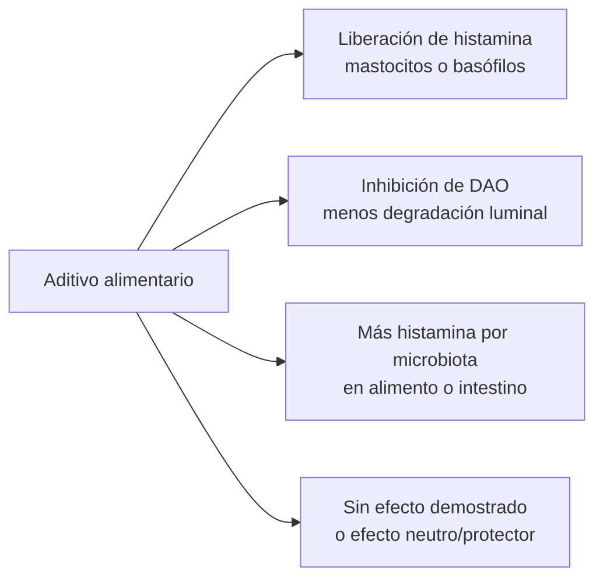

# Aditivos alimentarios, histamina y DAO

## Resumen ejecutivo

La lectura global de la literatura es menos alarmista de lo que sugieren muchas listas de “alimentos y aditivos liberadores de histamina”. Entre los conservantes, gelificantes y edulcorantes habituales de los alimentos procesados, el único grupo con una señal relativamente sólida de riesgo histamínico directo es el de los **sulfitos**: existen estudios in vitro y ex vivo que muestran degranulación mastocitaria/basófila y liberación de histamina por vías no mediadas por IgE, además de provocaciones orales positivas en personas seleccionadas con sospecha clínica de hipersensibilidad. En cambio, los **benzoatos** muestran una señal más débil y rara; y varios conservantes, como **sorbatos** y **nitritos**, en modelos alimentarios reducen la formación de histamina en el propio alimento en lugar de aumentarla. citeturn31search3turn31search2turn35search0turn36search1turn21search0turn20search1turn20search3

Entre los gelificantes, la evidencia directa de perjuicio para intolerancia a histamina/deficiencia de DAO es escasa. **Carragenanos** son la excepción parcial: no destacan por liberar histamina de forma directa en modelos clásicos, pero sí por una literatura preclínica que los vincula con inflamación intestinal y alteración de la microbiota en contextos susceptibles. Por el contrario, **alginatos** y **pectinas** tienen incluso señales preclínicas en sentido opuesto, con inhibición de liberación de histamina o degranulación mastocitaria. citeturn24search2turn24search3turn24search10turn37search4turn37search12turn38search0turn38search8

Entre los edulcorantes, la evidencia más útil es negativa o indirecta. **Aspartamo** no aumentó la liberación de histamina en estudios celulares y no fue más probable que placebo para inducir urticaria/angioedema en un ensayo multicéntrico doble ciego. **Acesulfamo K**, **sucralosa** y **sacarina** sí tienen literatura preclínica sobre microbiota e inflamación intestinal, pero eso no equivale a demostrar aumento de histamina o inhibición de DAO en humanos; la señal es, por ahora, indirecta y poco consistente. Los **polioles** comunes no destacan por histamina; su problema más habitual es gastrointestinal osmótico, no histamínico. citeturn17search9turn17search1turn14view3turn15view1turn28search2turn29search19turn29search2

Mi conclusión práctica es esta: para una persona con sospecha de intolerancia a histamina o déficit de DAO, **no hay base fuerte para evitar de forma indiscriminada todos los E-numbers**. La priorización razonable es **sulfitos primero**, **benzoatos si existe sospecha individual**, **carragenanos si hay síntomas intestinales sensibles o patrón claro con productos ultraprocesados**, y mucha más cautela antes de culpar a gelificantes o edulcorantes de manera genérica. Además, en alimentos procesados la histamina suele venir más de la **fermentación, la maduración o el almacenamiento** que del aditivo en sí. citeturn25view3turn40view0turn20search1turn20search3turn20search9

## Marco de interpretación

La intolerancia a histamina suele conceptualizarse como un cuadro de **degradación insuficiente de histamina**, en gran parte intestinal, con protagonismo de la DAO. La evidencia reciente también subraya que la disbiosis con bacterias productoras de histamina puede contribuir al cuadro. Pero una parte importante del discurso clínico habitual —sobre todo las listas cerradas de “alimentos liberadores de histamina” o “bloqueadores de DAO”— sigue apoyándose en evidencia incompleta y a veces inconsistente. En una revisión reciente, se recalca que la capacidad “liberadora de histamina” postulada para muchos alimentos no está bien elucidada y que la evidencia sigue siendo inconclusa; además, los inhibidores de DAO mejor documentados son sobre todo **fármacos**, alcohol y otras aminas biógenas, no los aditivos aquí revisados. La misma revisión es útil para el marco conceptual, pero debe leerse con cautela porque declara conflicto de interés industrial. citeturn25view2turn25view3

Para este informe he priorizado, por orden, **provocaciones humanas controladas**, estudios clínicos con pruebas de activación, estudios **animales/in vitro** sobre mastocitos/basófilos/DAO, y revisiones de síntesis. He usado una escala analítica propia, no validada clínicamente: **0** = sin señal relevante; **1** = señal teórica o aislada; **2** = señal reproducible pero todavía limitada o indirecta; **3** = riesgo alto con evidencia humana convincente y consistente en población pertinente. Esa escala está pensada para orientar prudencia dietética, no para diagnosticar alergia ni HIT. En paralelo, conviene recordar que la positividad de pruebas de provocación con aditivos, cuando se hace con diseños rigurosos, suele ser **baja**. citeturn40view0turn21search16

El diagrama resume las rutas mecanísticas plausibles que sí son relevantes aquí: liberación de histamina desde mastocitos/basófilos, inhibición de DAO, aumento de formación microbiana de histamina en el alimento o en el intestino, o ausencia de efecto demostrado. citeturn25view2turn25view3turn31search3turn31search2

## Conservantes

El grupo con más relevancia clínica potencial es el de los **sulfitos**. La bibliografía mecanística es bastante consistente: el sulfito sódico induce degranulación mastocitaria y formación de especies reactivas de oxígeno; además, basófilos de sangre periférica muestran liberación de histamina al exponerse a sulfito. Un trabajo posterior añadió un mecanismo de **piroptosis** mastocitaria como explicación de la degranulación. En humanos, el fenotipo más clásico es la sensibilidad a sulfitos en asma, pero también existen urticaria, angioedema y reacciones sistémicas en personas susceptibles; en una cohorte de pacientes con urticaria y sospecha de hipersensibilidad a aditivos, 13 de 64 provocaciones orales con metabisulfito fueron positivas. Esto no equivale a “déficit de DAO”, pero sí justifica una prioridad práctica alta dentro de los aditivos. citeturn31search3turn31search11turn31search2turn35search0turn34search7turn34search21

Los **benzoatos**, sobre todo el benzoato sódico, ocupan un lugar intermedio. La señal clínica existe, pero es débil y poco prevalente. Un ensayo aleatorizado/controlado en pacientes con urticaria/angioedema sugestivos de reacción a benzoato concluyó que la tasa de episodios repetidos inducidos por benzoato sódico era de solo **2%**. Un estudio de activación basofílica en urticaria crónica halló un positivo a benzoato entre 15 sujetos. A la vez, un estudio clásico en mastocitos peritoneales de rata no encontró degranulación ni liberación significativa de histamina por benzoato sódico. En otras palabras: hay **reacción individual rara**, pero no una propiedad liberadora sólida y generalizable. citeturn36search1turn36search16turn30search7turn30search14

Los **sorbatos** y los **nitritos/nitratos** son importantes precisamente porque contradicen parte del relato popular sobre “todos los conservantes empeoran la histamina”. En modelos alimentarios, el sorbato potásico inhibió el crecimiento y la producción bacteriana de histamina; y en embutidos fermentados, aumentar el nitrito redujo histamina y otras aminas biógenas. Esto no convierte a estos aditivos en “beneficiosos” para todos los fines, pero sí significa que, desde el punto de vista histamínico, no deberían ponerse en el mismo saco que los sulfitos. Además, en una serie de 100 pacientes con urticaria crónica idiopática sometidos a provocación rigurosa con 11 aditivos —incluyendo nitrito y nitrato sódicos— no hubo confirmaciones positivas en doble ciego. citeturn21search0turn20search1turn20search3turn40view0

Para **propionatos** y **parabenos alimentarios**, la evidencia orientada específicamente a histamina/DAO es pobre. En propionatos no identifiqué estudios directos relevantes; por analogía fisiológica, el propionato como SCFA suele asociarse a menor activación mastocitaria, no mayor. Para metilparabeno, la mejor evidencia humana disponible en esta pregunta es negativa o muy débil; la provocación rigurosa en urticaria crónica no apoyó un papel importante. citeturn22search1turn22search2turn40view0

## Gelificantes

Aquí la literatura es mucho más tranquilizadora. El **carragenano** merece una cautela distinta, pero no por el mecanismo que más preocupa en HIT. En un modelo clásico de inflamación aguda, el carragenano **no** causó degranulación mastocitaria ni liberación de histamina; sin embargo, revisiones y estudios más recientes lo vinculan con inflamación intestinal y disbiosis en modelos preclínicos, e incluso con efectos proinflamatorios directos sobre epitelio intestinal en contextos inflamatorios. Para personas con síntomas intestinales que ya sospechan HIT/DAO, esto sugiere una **vía indirecta plausible**, no una prueba de que sea un liberador de histamina. citeturn24search2turn24search3turn24search10turn24search1

En contraste, **alginatos** y **pectinas** tienen señales preclínicas más bien favorables. El ácido algínico ha mostrado inhibición de la liberación de histamina desde mastocitos y efectos anti-anafilácticos en modelos animales; y los oligosacáridos de pectina redujeron degranulación, histamina e IL-4 en mastocitos, además de disminuir frecuencia y activación mastocitaria intestinal en un modelo murino de alergia alimentaria. Ninguno de estos hallazgos basta para recomendar “usar alginato o pectina como tratamiento”, pero sí reduce bastante la plausibilidad de que sean aditivos problemáticos por histamina/DAO en sentido directo. citeturn37search4turn37search0turn37search12turn38search0turn38search4turn38search8

Para **agar**, **goma xantana** y **goma garrofín**, no localicé estudios primarios sólidos que demostraran liberación de histamina, contenido de histamina o inhibición de DAO. En **goma guar** sí aparecen casos de asma ocupacional y alergia clásica, que son realidades distintas de la intolerancia a histamina. A la vez, la literatura general sobre fibra y SCFA suele apuntar a efectos antiinflamatorios y moduladores negativos de la activación mastocitaria. Mi lectura es que, salvo patrón individual muy claro, estos gelificantes merecen mucha menos atención que los conservantes. citeturn11search1turn37search7turn38search6

## Edulcorantes

El caso mejor resuelto es el del **aspartamo**. El estudio celular clásico no encontró aumento agudo de la liberación de histamina mediada por IgE, y el ensayo multicéntrico, aleatorizado, doble ciego y cruzado concluyó que aspartamo y sus productos de conversión no eran más propensos que el placebo a desencadenar urticaria o angioedema. Con la evidencia disponible, no hay base sólida para clasificarlo como liberador de histamina ni como inhibidor de DAO. citeturn17search9turn17search3turn17search1

Con **acesulfamo K**, **sucralosa** y **sacarina**, la historia es más ambigua pero menos específica. Para acesulfamo K, varios estudios en ratón describen alteraciones del microbioma, cambios metabólicos y lesión/inflamación intestinal; para sucralosa y sacarina, revisiones amplias resumen disbiosis e inflamación intestinal en literatura preclínica. Sin embargo, esto no demuestra por sí solo un aumento de histamina ni una inhibición de DAO. De hecho, para sacarina existe ya un estudio reciente en humanos sanos y ratones que **no** halló cambios de microbiota ni intolerancia a la glucosa con suplementación alta, lo que subraya la inconsistencia del campo. Mi conclusión es que estos edulcorantes merecen una clasificación de **riesgo indirecto bajo** cuando existe un perfil intestinal sensible, pero no una condena general para HIT/DAO. citeturn14view3turn10search16turn15view1turn28search2

Los **ciclamatos**, los **glucósidos de esteviol** y los **polioles** comunes quedan todavía más abajo en la escala de preocupación histamínica. Para los polioles, la evidencia humana disponible se orienta más a microbiota neutra o levemente prebiótica —el eritritol no se fermenta por la microbiota intestinal humana y el xilitol ha mostrado efectos prebióticos en estudios limitados—, mientras que los síntomas típicos son flatulencia, distensión o efecto laxante, no manifestaciones histamínicas. Eso es clínicamente importante porque muchos pacientes atribuyen a “histamina” síntomas que, con polioles, a menudo son simplemente fermentativos u osmóticos. citeturn29search19turn29search2turn28search8

## Tabla comparativa

Los nombres químicos y códigos E se comprobaron con listados oficiales de entity["organization","EFSA","eu food safety authority"], la entity["organization","Food Standards Agency","uk food authority"], la entity["organization","Comisión Europea","eu executive body"] y la entity["organization","Agencia Española de Seguridad Alimentaria y Nutrición","spain food safety agency"]. citeturn26search0turn27search0turn33search3turn33search17

| Aditivo | Categoría | Nombres/códigos | Mecanismo potencial | Evidencia y referencias clave | Clasificación 0–3 | Nivel de confianza |
|---|---|---|---|---|---:|---|
| Sulfitos | Conservante | Dióxido de azufre y sulfitos (E220–E228) | **Liberador** directo de histamina; pseudoalergia no IgE; no prueba directa de bloqueo DAO | In vitro/ex vivo: degranulación mastocitaria y liberación de histamina; 2021: piroptosis mastocitaria; humanos seleccionados con urticaria: 13/64 provocaciones orales positivas. citeturn31search3turn31search11turn31search2turn35search0 | 2 | Moderada |
| Benzoatos | Conservante | Ácido benzoico/benzoatos, p. ej., benzoato sódico (E210–E213) | **Indirecto** o liberación rara; no evidencia consistente de bloqueo DAO | Humano: RCT/controlado, 2% de confirmación en sospecha de urticaria/angioedema; BAT positivo en 1/15; estudio clásico en mastocitos de rata negativo. citeturn36search1turn36search16turn30search7 | 1 | Moderada |
| Sorbatos | Conservante | Ácido sórbico y sorbatos (E200–E203) | **Indirecto reductor** de formación de histamina en alimentos | Modelo alimentario: sorbato potásico inhibe crecimiento bacteriano y producción de histamina; revisión regulatoria sin casos documentados de alergia alimentaria inducida. citeturn21search0turn21search23 | 0 | Moderada |
| Nitritos y nitratos | Conservante | Nitrito potásico/sódico y nitrato sódico/potásico (E249–E252) | **Indirecto reductor** de formación de histamina en alimentos | Estudios en embutidos fermentados: más nitrito, menos histamina/aminas biógenas; en provocación rigurosa de CIU no hubo positivos confirmados a nitrito/nitrato. citeturn20search1turn20search3turn40view0 | 0 | Moderada |
| Propionatos | Conservante | Ácido propiónico/propionatos, p. ej., propionato cálcico (E280–E283) | Sin señal convincente; teóricamente no prohistamínico | No localicé estudios directos sobre HIT/DAO; por analogía fisiológica, el propionato como SCFA suele asociarse a menor activación mastocitaria. citeturn22search1turn22search2 | 0 | Baja |
| Parabenos alimentarios | Conservante | Etil p-hidroxibenzoato (E214), sodio etilparabeno (E215), metil p-hidroxibenzoato (E218), sodio metilparabeno (E219) | Señal clínica rara; sin evidencia sólida de HIT/DAO | En provocación rigurosa de urticaria crónica, metilparabeno no mostró positividad confirmada; la actividad de liberación de histamina descrita in vitro se ha visto sobre todo con parabenos de cadena larga no alimentarios. citeturn40view0turn30search1 | 1 | Baja |
| Carragenanos | Gelificante | Carragenano (E407), alga Eucheuma procesada (E407a) | **Indirecto**: inflamación intestinal/microbiota; no liberador histamínico directo convincente | Animal clásico: sin degranulación mastocitaria ni liberación de histamina; revisiones y estudios recientes: posible inflamación intestinal y disbiosis. citeturn24search2turn24search3turn24search10turn24search1 | 1 | Baja |
| Alginatos | Gelificante | Ácido algínico y alginatos (E400–E405) | **Inhibidor** preclínico de liberación de histamina | In vitro/animal: inhibición de liberación de histamina y efecto anti-anafiláctico; en alergia alimentaria murina reduce degranulación mastocitaria. citeturn37search4turn37search0turn37search12 | 0 | Moderada |
| Pectinas | Gelificante | Pectina (E440) | **Inhibidor** preclínico de degranulación/histamina | Oligosacáridos de pectina reducen histamina, β-hexosaminidasa e IL-4; en ratón alérgico reducen mastocitos intestinales y activación. citeturn38search0turn38search4turn38search8 | 0 | Moderada |
| Agar | Gelificante | Agar (E406) | Sin efecto demostrado | No localicé estudios directos sobre histamina o DAO orientados a HIT. | 0 | Muy baja |
| Goma guar | Gelificante | Guar gum (E412) | Riesgo **indirecto bajo**; rara alergia clásica, no HIT | Casos de asma ocupacional/IgE; la literatura general sobre fibra fermentable apunta más a efectos antiinflamatorios que prohistamínicos. citeturn11search1turn37search7turn38search6 | 1 | Baja |
| Goma xantana | Gelificante | Xanthan gum (E415) | Sin efecto demostrado | No localicé estudios directos sólidos sobre histamina/DAO orientados a HIT. | 0 | Muy baja |
| Goma garrofín | Gelificante | Locust bean gum/carob gum (E410) | Sin efecto demostrado | No localicé estudios directos sólidos sobre histamina/DAO orientados a HIT. | 0 | Muy baja |
| Aspartamo | Edulcorante | Aspartame (E951) | Sin efecto demostrado; **no liberador** en estudios directos | In vitro: no aumenta liberación histamínica IgE-mediada; RCT multicéntrico doble ciego: no más urticaria/angioedema que placebo. citeturn17search9turn17search3turn17search1 | 0 | Moderada |
| Acesulfamo K | Edulcorante | Acesulfame potassium (E950) | **Indirecto** y mixto: microbiota/inflamación; sin datos DAO | Ratón: disbiosis, aumento de peso o lesión intestinal según modelo; la literatura no demuestra aumento de histamina ni bloqueo DAO en humanos. citeturn14view3turn10search16turn15view1 | 1 | Baja |
| Sucralosa | Edulcorante | Sucralose (E955) | **Indirecto**: disbiosis e inflamación intestinal preclínica | Revisión amplia y estudios en roedores describen alteraciones de microbiota, infiltrado inflamatorio y empeoramiento de colitis susceptible; sin evidencia directa sobre histamina/DAO. citeturn15view1 | 1 | Baja |
| Sacarina | Edulcorante | Saccharins (E954) | **Indirecto** y mixto: microbiota; no DAO demostrado | Modelos/revisiones: efectos bacteriostáticos y disbióticos; estudio reciente en sanos y ratones no halló cambios de microbiota ni intolerancia a glucosa con alta dosis. citeturn15view1turn28search2 | 1 | Baja |
| Ciclamatos | Edulcorante | Cyclamates (E952) | Sin efecto demostrado | No localicé estudios directos sobre histamina/DAO orientados a HIT. | 0 | Muy baja |
| Glucósidos de esteviol | Edulcorante | Steviol glycosides (E960) | Sin señal directa demostrada | Metabolismo bacteriano descrito, pero sin evidencia de aumento de histamina o inhibición de DAO en la literatura revisada. citeturn15view1 | 0 | Baja |
| Polioles comunes | Edulcorante | Sorbitoles (E420), xilitol (E967), eritritol (E968) | No contienen histamina; efectos microbiota neutros o prebióticos; principal problema es GI y osmótico | Revisión humana: xilitol con posibles efectos prebióticos, aunque con limitaciones; eritritol no se fermenta por microbiota humana; el problema típico es digestivo, no histamínico. citeturn28search8turn29search19turn29search2 | 0 | Moderada |

## Recomendaciones prácticas y lagunas de conocimiento

En etiquetado, la estrategia útil no es “evitar todos los E”. En la Unión Europea, los aditivos deben figurar por su **clase funcional** seguida de su nombre o número E; por eso conviene aprender a detectar tanto “conservador: metabisulfito potásico” como “conservador: E224”. Para una persona con sospecha de HIT/DAO, la prioridad razonable es revisar primero **E220–E228** y después **E210–E213** si hay un patrón repetido con refrescos, salsas, conservas, vinagres, zumos, frutos desecados o vinos. En el caso de sulfitos, el umbral regulatorio de declaración es superior a **10 mg/kg o 10 mg/L** expresados como SO₂, de modo que el etiquetado sí tiene valor práctico real. citeturn33search3turn33search5turn33search17turn32search1turn32search4

La segunda recomendación es separar **síntomas histamínicos** de **síntomas no histamínicos**. Si un producto “sin azúcar” provoca hinchazón, gases o diarrea, los polioles son una explicación mucho más probable que una subida de histamina. Si la reacción es más tipo urticaria, flushing o picor inmediato, el foco inicial tiene más sentido en sulfitos o, bastante más raramente, benzoatos. Si la molestia principal es intestinal y aparece con lácteos alternativos, carnes reestructuradas o salsas espesas, entonces carragenanos pueden merecer una prueba de retirada individual, pero como hipótesis **indirecta**, no como liberador histamínico probado. citeturn29search19turn31search3turn36search1turn24search3turn24search10

La tercera recomendación es no perder de vista el **alimento matriz**. Un embutido curado, un pescado conservado o unas sobras mal refrigeradas pueden ser problemáticos por la **histamina ya formada** durante fermentación o almacenamiento, incluso cuando el conservante presente no sea el culpable —e incluso cuando nitrito o sorbato hayan reducido parte de esa formación. En otras palabras: para seleccionar alimentos, pesa más “fresco frente a madurado/fermentado/almacenado” que la mera presencia de un aditivo aislado. citeturn25view3turn20search1turn20search3turn20search9

Finalmente, la literatura tiene varias lagunas serias. Casi no hay estudios que prueben estos aditivos **en pacientes con HIT o DAO baja bien caracterizados**; casi no existen estudios directos de **inhibición de DAO** por los aditivos revisados; la mayor parte de la evidencia mecanística relevante procede de mastocitos, modelos de urticaria o trabajos sobre microbiota e inflamación, no de ensayos clínicos específicos de HIT. Además, muchas listas clínicas siguen mezclando alergia verdadera, pseudoalergia, intolerancia fermentativa y supuesta “liberación de histamina” sin distinguir bien mecanismos. Por eso, la mejor práctica sigue siendo una **retirada selectiva y breve**, seguida de **reexposición estructurada**, en lugar de una exclusión indefinida y extensa de todos los ultraprocesados o todos los aditivos. citeturn25view3turn40view0turn29search7