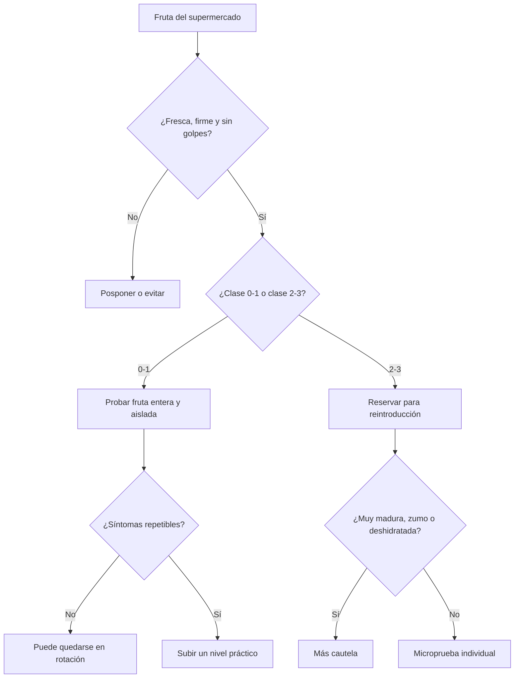

# Frutas de supermercado para intolerancia a la histamina y deficiencia de DAO

## Resumen ejecutivo

En fruta fresca corriente, el problema **no suele ser una “histamina alta” comparable a la de alimentos fermentados o pescado mal conservado**, sino una combinación de tres cosas: presencia ocasional de histamina en pocas frutas, sobre todo **aguacate**; presencia más frecuente de **otras aminas biógenas** —especialmente putrescina— que pueden competir con la histamina por la DAO; y, en varias frutas tradicionalmente “prohibidas”, una etiqueta de “liberadoras de histamina” que sigue teniendo una base mecanística débil o no demostrada de forma convincente. citeturn2view0turn25view0turn27view0turn37view0

Con esa evidencia, las frutas que veo como **peor apuesta práctica** para una fase estricta de eliminación son **aguacate** y **pasas**, y también **plátano** y los **cítricos** habituales —naranja, mandarina, limón y pomelo— por su carga de putrescina y su presencia recurrente en listas clínicas. En cambio, las frutas que mejor encajan, en promedio, son **manzana, melocotón, nectarina, albaricoque, cereza, arándano, mora de zarza, melón, granada, coco** y, probablemente, **mango**. Entre medias quedan **pera, ciruela, uva, kiwi, piña, fresa, frambuesa, papaya, sandía, higo y higo seco**, donde manda mucho la tolerancia individual y la incertidumbre es mayor. citeturn3view0turn3view1turn3view4turn15view0turn15view1turn19search1turn23view0turn6view0turn6view1

La **madurez y el formato** cambian bastante el riesgo. Los plátanos y las uvas empeoran al madurar; el aguacate muy blando y oxidado es mala apuesta; los zumos de cítricos y piña son más inciertos que la fruta entera; y la fruta deshidratada concentra la exposición y puede añadir problemas de almacenamiento o aditivos. Para la práctica diaria, la combinación más sensata suele ser: **fruta entera, fresca, firme, de una en una, y sin mezclar varias sospechosas en la misma comida**. citeturn13search0turn19search1turn3view2turn23view0turn36view0

## Criterios de evaluación

Este informe está pensado para compras de fruta corriente en supermercados de entity["country","España","iberian country"]. He asumido **estado de madurez comercial medio**: fruta ya comestible, pero no sobremadura. La base analítica procede sobre todo de revisiones y estudios del grupo de la entity["organization","Universitat de Barcelona","barcelona university spain"] sobre aminas biógenas en alimentos vegetales —incluyendo productos del mercado español—, complementados con el marco toxicológico de la entity["organization","Autoridad Europea de Seguridad Alimentaria","food safety agency eu"] y con la lista clínica de la entity["organization","Swiss Interest Group Histamine Intolerance","patient group switzerland"], que aquí uso como **apoyo pragmático**, no como árbitro absoluto, porque su escala refleja compatibilidad clínica percibida, no histamina medida, y mezcla literatura con experiencia de pacientes. citeturn2view0turn25view0turn36view0turn37view0

La escala que empleo **no es un estándar validado**; es una síntesis operativa de la evidencia disponible. La interpreto así: **0** = compatible en general; **1** = precaución leve, suele poder probarse pronto; **2** = problema frecuente o razonable para reservar a reintroducción; **3** = mala apuesta en eliminación estricta. El salto entre categorías **no significa toxicidad alimentaria clásica**; significa más bien **probabilidad práctica de dar problemas** en una persona con intolerancia a histamina o baja DAO. La incertidumbre sube cuando la literatura mide pocas aminas o cuando la exclusión se basa sobre todo en el concepto de “liberador de histamina”. citeturn25view0turn27view0turn36view0

Para la justificación he priorizado, por este orden, **histamina medida**, **otras aminas relevantes** —sobre todo putrescina y cadaverina, que sí interfieren con la degradación de histamina por DAO in vitro—, **tiramina/poliaminas**, y finalmente la **consistencia clínica** de las listas de eliminación. Importa subrayar que, para estas frutas, **no he encontrado pruebas sólidas de inhibición directa de DAO por la fruta en sí**; lo mejor respaldado es la **competencia por la DAO** de otras aminas, especialmente putrescina y cadaverina, y en menor medida tiramina, espermidina y espermina a concentraciones altas. citeturn27view0turn2view0

La lógica práctica que mejor encaja con la evidencia es esta: frescura primero, luego clase de riesgo, y después reintroducción individual, porque la tolerancia es dosis-dependiente y muy variable entre personas. citeturn8view0turn25view0turn36view0

## Tabla comparativa

**Nota previa:** interpreto **mora** como **mora de zarza / blackberry**, no morera. En **dátil, higo seco y pasas** asumo producto simple, sin sulfitos ni otros aditivos, salvo que se indique lo contrario en la etiqueta. La incertidumbre “alta” significa precisamente eso: **poca analítica directa y mucho apoyo en listas clínicas o experiencia empírica**. citeturn36view0

| Fruta | Clasificación | Justificación resumida | Incertidumbre | Recomendación |
|---|---:|---|---|---|
| **Manzana** | **0** | Histamina no detectada o mínima en las series disponibles; putrescina muy baja. citeturn3view0turn5view1 | Bajo | Buena fruta base. Mejor entera, fresca y no golpeada. |
| **Pera** | **1** | Histamina casi ausente, pero se han descrito niveles relativamente altos de putrescina y poliaminas; por eso algunas revisiones la discuten más de lo que sugieren las listas “seguras”. citeturn15view1turn5view3 | Medio | Probar pronto, pero en ración moderada y aislada si la fase es muy estricta. |
| **Plátano** | **2** | Histamina baja, pero putrescina alta; durante la maduración cambian varias aminas y clínicamente suele tolerarse peor cuanto más maduro está. citeturn3view1turn13search0turn5view0 | Medio | Si se prueba, mejor poco maduro o amarillo sin motas. Evitar muy maduro, batidos y purés maduros. |
| **Naranja** | **2** | El problema es sobre todo putrescina muy alta, no histamina del fruto fresco; algunos zumos pueden adquirir histamina por procesado/almacenamiento. Las listas clínicas la castigan más que la analítica pura. citeturn15view0turn3view2turn5view3 | Medio | Mejor evitar en eliminación. Si se reintroduce, fruta entera mejor que zumo; evitar ralladura/piel. |
| **Mandarina** | **2** | Putrescina alta, con rangos amplios; el contenido puede subir con frío pre-cosecha y daño mecánico en la piel. citeturn15view0turn3view2turn6view1 | Medio | Parecida a la naranja, aunque a veces algo mejor tolerada por dosis menor. Mejor gajos que zumo. |
| **Limón** | **2** | En el pulp no parece un gran aportador de histamina, pero pertenece al grupo cítrico con putrescina elevada; la piel y la ralladura son clínicamente peores. citeturn15view0turn3view2turn6view1 | Medio | Como fruta no es buena apuesta. Como condimento, algunas personas toleran unas gotas mejor que una ración. Evitar piel/zest. |
| **Pomelo** | **2** | Putrescina alta en fruta fresca y aún mayor en zumo; la histamina en zumos se ha atribuido a problemas de procesado o conservación, no a la fruta original. citeturn3view1turn3view2turn5view0 | Medio | Reservar para reintroducción. Mejor evitar zwumo y piezas muy blandas o dañadas. |
| **Fresa** | **1** | La revisión analítica encontró niveles demasiado bajos para justificar su exclusión por aminas; aun así muchas listas la tratan como “liberadora”, con mecanismo poco claro. citeturn3view4turn25view0turn5view4 | Alto | Si ya sabes que te da problemas, trátala como clase 2 en tu caso. Si no, prueba en pequeña cantidad y sola. |
| **Frambuesa** | **1** | Mucha de su mala fama viene de listas clínicas y del concepto de “liberador”, no de buena analítica directa en histamina/otras aminas. citeturn25view0turn6view1 | Alto | Introducción cauta e individual. Si hay síntomas repetibles, subir a 2 práctico. |
| **Arándano** | **0** | Hay poca analítica específica, pero no está entre las frutas repetidamente señaladas y las listas clínicas la consideran de las mejor toleradas. citeturn5view0turn36view0 | Medio | Buena apuesta para empezar, preferiblemente fresco o congelado sin aditivos. |
| **Mora** | **0** | Para mora de zarza/blackberry la experiencia clínica es favorable y no hay señales analíticas fuertes de riesgo; la evidencia, eso sí, es escasa. citeturn5view0turn36view0 | Medio | Apta como fruta de prueba temprana. Si es mora de morera, la evidencia es más escasa. |
| **Cereza** | **0** | Los pocos datos disponibles muestran putrescina baja y sin histamina relevante; clínicamente suele tolerarse bien, aunque alguna lista la llama “controvertida”. citeturn3view1turn5view0 | Medio | Buena candidata, mejor fresca y firme. |
| **Melocotón** | **0** | Analítica compatible con baja carga de aminas; sin señal fuerte de histamina ni otras aminas problemáticas. citeturn15view1turn6view1 | Bajo | De las mejores apuestas en fruta de hueso. |
| **Nectarina** | **0** | Datos directos escasos, pero clínicamente suele comportarse como el melocotón y no aparece como fruta de alto riesgo. citeturn6view1turn36view0 | Medio | Introducción razonable pronto, como fruta de hueso “segura”. |
| **Albaricoque** | **0** | Poca evidencia analítica directa, pero las listas clínicas lo sitúan entre las frutas mejor toleradas. citeturn5view1turn36view0 | Alto | Úsalo como fruta de prueba si está fresco y no sobremaduro. |
| **Ciruela** | **1** | No destaca por histamina, pero sí se ha descrito tiramina en algunos análisis; aun así, una revisión concluye que sus niveles no bastan para justificar la exclusión sistemática. citeturn3view4turn15view1turn6view1 | Medio | Mejor madura normal, no muy blanda. Si te desencadena, suele ser por sensibilidad individual. |
| **Uva** | **1** | Los datos analíticos son modestos en uva fresca, pero la maduración aumenta varias aminas, incluida histamina en estudios de mesa; por eso las muy maduras y las pasificadas son peor apuesta. citeturn3view1turn19search1turn6view1 | Medio | Mejor fresca y no sobremadura. Si se deja mucho en nevera o empieza a pasificarse, tratarla más como clase 2. |
| **Kiwi** | **1** | Se ha descrito histamina en algunas series, putrescina moderada y además el kiwi destaca por tryptamina en un estudio japonés; pese a ello, la revisión global concluye que la carga de aminas suele ser demasiado baja para excluirlo de entrada. citeturn3view5turn24search3turn6view1 | Alto | Prueba individual y pequeña. Si tienes historial de reacción inmediata, considerar también alergia. |
| **Piña** | **1** | La fruta fresca muestra aminas bajas; la propia revisión concluye que no hay base suficientemente sólida para excluirla por aminas. La incertidumbre sube con zumos y producto procesado. citeturn15view1turn3view2turn6view1 | Medio | Mejor fresca entera que zumo. Si está muy madura o triturada, más cautela. |
| **Mango** | **0** | En la revisión de frutas del mercado español aparece con putrescina muy baja, y en el trabajo sobre frutas tropicales fue la de menor carga total de aminas entre las analizadas. Algunas listas clínicas, aun así, la ponen en observación. citeturn15view0turn17search5turn6view1 | Medio | Buena opción, pero si eres extremadamente sensible introdúcelo como si fuera clase 1. |
| **Papaya** | **1** | La revisión crítica la incluye entre las frutas con niveles demasiado bajos para justificar exclusión, aunque algunas listas clínicas la penalizan. citeturn15view1turn17search5turn6view1 | Alto | Reintroducción cauta. Mejor pieza fresca, no licuados ni fruta muy madura acumulada. |
| **Aguacate** | **3** | Es la fruta con peor señal analítica: se han descrito niveles relevantes de histamina, además de tiramina. Es la excepción más clara entre frutas frescas. citeturn3view0turn30search0turn5view2 | Medio | Evitar en eliminación. Si se reintroduce, solo pieza muy firme y recién abierta; si está blanda u oxidada, mantener evitación. |
| **Sandía** | **1** | La mala fama es casi toda clínica/empírica como posible “liberadora”; faltan datos analíticos sólidos que la sostengan. citeturn5view4turn25view0 | Alto | Si está muy fría o muy madura puede confundir por tolerancia digestiva. Probar sola y en poca cantidad. |
| **Melón** | **0** | Las listas clínicas suelen permitirlo, excepto a veces la sandía; no hay una señal analítica clara de aminas problemáticas. citeturn6view1turn36view0 | Alto | Buena opción de inicio, mejor fresco y no pasado. |
| **Higo** | **1** | La evidencia directa es escasa; clínicamente se suele considerar de precaución leve, tanto fresco como seco. citeturn5view0turn36view0 | Alto | Mejor fresco y poco maduro. Si está muy dulce, blando o desecándose, aumenta la cautela. |
| **Granada** | **0** | No hay buena señal de riesgo por aminas y las listas clínicas la consideran favorable; la evidencia analítica específica sigue siendo limitada. citeturn6view1turn36view0 | Medio | Fruta razonable para rotación. Mejor fresca, no zumo comercial. |
| **Coco** | **0** | Buena tolerancia clínica y sin señal analítica fuerte de histamina/otras aminas en la fruta simple. citeturn5view0turn36view0 | Medio | Mejor coco natural; vigilar aditivos si es rallado, bebida o postre. |
| **Dátil** | **0** | Para dátil simple la experiencia clínica es relativamente favorable, pero faltan datos analíticos buenos y en la práctica suele venderse semidesecado o con añadidos. citeturn5view0turn36view0 | Alto | Elegir natural, sin sulfitos ni jarabes. Si eres sensible a fruta deshidratada, úsalo como clase 1 práctica. |
| **Higo seco** | **1** | Igual que el higo fresco, pero con la deshidratación aumenta la prudencia por concentración y almacenamiento; la evidencia directa sigue siendo limitada. citeturn5view0turn36view0 | Alto | Mejor dejarlo para una fase tardía de reintroducción. |
| **Pasas** | **2** | Aquí sí hay datos directos: alrededor de 13 mg/kg de histamina y 22–28 mg/kg de putrescina en el estudio localizado, muy por encima de la uva fresca. Las listas clínicas discrepan, pero analíticamente merecen más cautela. citeturn23view0turn6view1 | Medio | Evitar al principio. Si se prueban, que sean pocas, sin sulfitos y no junto a otros sospechosos. |

## Frutas que merecen más cautela

### Aguacate

El **aguacate** es la fruta con la señal más firme de riesgo dentro del conjunto revisado. En la revisión de alimentos vegetales se destaca como una de las pocas frutas con **histamina descrita de manera relevante**, con un valor de hasta **23 mg/kg** en una publicación, además de **tiramina**; por eso, aunque muchas listas le dan un 2 clínico, para un contexto de **intolerancia a la histamina/DAO baja** en fase de eliminación me parece razonable tratarlo como **3 práctico** si está maduro medio-listo para comer, que es justamente como suele llegar al lineal. El matiz importante es la madurez: una pieza más firme y recién abierta puede ser menos problemática que un aguacate muy blando, oxidado o convertido en guacamole almacenado. citeturn3view0turn30search0turn5view2

### Cítricos

En **naranja, mandarina, limón y pomelo** el argumento fuerte **no es la histamina del fruto fresco**, sino la **putrescina alta** y muy variable. La revisión del grupo de Barcelona muestra rangos muy amplios en cítricos, con valores especialmente altos en naranja, mandarina y pomelo, y recuerda que la histamina observada en zumos de cítricos y piña se atribuyó a problemas de procesado o almacenamiento, no a la fruta original. Eso explica por qué estas frutas están tan frecuentemente excluidas en dietas bajas en histamina, aunque la base bioquímica sea más bien **competencia por la DAO** que “histamina alta” en sentido estricto. Por eso las he dejado en **2**, no en 3: son mala apuesta temprana, pero no equivalen a un alimento fermentado rico en histamina. citeturn3view2turn15view0turn25view0turn27view0

### Plátano y uva

El **plátano** es el otro gran clásico problemático. Las razones son coherentes: **putrescina alta** en alimento fresco y una clara influencia de la **maduración** sobre el perfil de aminas. En el estudio de maduración de bananas y plátanos descienden varias aminas durante la maduración de la pulpa, pero la **putrescina aumenta**, y clínicamente la observación de que “cuanto más verde, mejor” sigue teniendo bastante sentido práctico. La **uva fresca** es menos problemática, pero la maduración aumenta varias aminas en uva de mesa, incluida histamina, y el paso a **pasa** cambia mucho el escenario: en pasas sí aparecen cantidades medibles de histamina y putrescina que justifican subir un escalón. citeturn3view1turn13search0turn19search1turn23view0

### Fresa, frambuesa, kiwi, piña y papaya

Este es el bloque más discutible y donde más se notan las contradicciones entre analítica y listas clínicas. La revisión crítica de dietas bajas en histamina encontró que **kiwi, papaya, fresa, piña y ciruela** tenían niveles de aminas **demasiado bajos para justificar exclusión sistemática**, y la revisión de 2021 añade que muchas frutas excluidas lo son por su etiqueta de “liberadoras de histamina”, aunque el mecanismo **no esté aclarado**. Eso no significa que nadie reaccione; significa que, a día de hoy, la reacción no se explica bien por “histamina del alimento”. Por eso las he bajado a **1** —o las he dejado con incertidumbre alta—, con una excepción práctica: si una persona ya sabe que una de estas le desencadena síntomas de forma reproducible, esa fruta concreta pasa a ser **2 personal**, aunque la literatura no lo sostenga con la misma claridad. citeturn15view1turn25view0turn36view0

## Frutas que suelen encajar mejor

El grupo más favorable es bastante estable: **manzana, melocotón, nectarina, albaricoque, cereza, arándano, mora de zarza, melón, granada, coco** y muy probablemente **mango**. En unas —como la manzana, el melocotón o la cereza— sí hay medidas analíticas compatibles con niveles bajos; en otras —como nectarina, albaricoque, melón, granada o coco— la seguridad viene más de la ausencia de mala señal repetida y de una buena tolerancia clínica acumulada, por lo que la incertidumbre no desaparece del todo. El **mango** merece una mención aparte: es de las frutas que salen mejor paradas cuando se mide carga total de aminas, de modo que me parece más razonable tratarlo como **0** que como “fruta sospechosa” por defecto. citeturn3view0turn3view1turn15view0turn17search5turn5view0turn6view1

Las frutas “casi seguras, pero no del todo” son **pera, ciruela, uva, sandía, higo, higo seco y dátil**. La **pera** complica el esquema porque tiene fama de fruta amable, pero la revisión de aminas vegetales la destaca por su carga de putrescina y poliaminas; la **ciruela** muestra tiramina en algunas series; la **uva** empeora con la maduración; la **sandía** arrastra sobre todo una sospecha clínica mal explicada; y en **higos** y **dátiles** la ciencia directa es pobre, así que aquí manda mucho la individualización. Dicho de otro modo: estas frutas no están “prohibidas”, pero tampoco son mi primera elección si alguien quiere una fase inicial muy limpia. citeturn15view1turn3view4turn19search1turn5view4turn5view0turn36view0

## Recomendaciones prácticas y referencias clave

En la práctica, la regla más útil es **priorizar la fruta entera sobre el zumo**, la **pieza firme sobre la sobremadura**, y la **fruta fresca sobre la deshidratada**. Para la reintroducción, tiene sentido hacerlo **una fruta cada vez**, en **cantidad pequeña al principio**, y no combinar el mismo día varias de clase 1–2. La lista clínica clásica aconseja usar una pauta estricta solo de inicio y empezar a probar tolerancias tras **4–6 semanas**, precisamente porque la respuesta es muy individual y dosis-dependiente. También conviene leer etiquetas en fruta deshidratada, donde pueden aparecer **sulfitos, conservantes o azúcares añadidos** que confunden la interpretación. citeturn3view2turn23view0turn36view0

Si la reacción a una fruta es **inmediata** y domina el **picor oral, hormigueo en labios o garganta, hinchazón**, o si hay **urticaria intensa, disnea o síntomas rápidos y reproducibles**, hay que pensar no solo en histamina/DAO, sino también en **alergia a fruta** o **síndrome polen-alimento**, especialmente con kiwi, fresa, cítricos y otras frutas crudas. Ese patrón requiere valoración alergológica, no solo ajuste dietético de histamina. citeturn38search0turn38search15

Las fuentes más determinantes para este informe han sido las revisiones de **histamina e intolerancia a histamina** y de **aminas biógenas en alimentos vegetales**, la revisión crítica de **dietas bajas en histamina**, el estudio in vitro sobre **competencia por la DAO**, los trabajos sobre **maduración del plátano**, **maduración de la uva** y **pasas**, la serie clínica pediátrica en español sobre intolerancia a histamina y la lista clínica de compatibilidad de SIGHI, usada siempre con cautela por su naturaleza mixta. citeturn11search17turn37view0turn2view0turn25view0turn27view0turn13search0turn19search1turn23view0turn8view0turn36view0