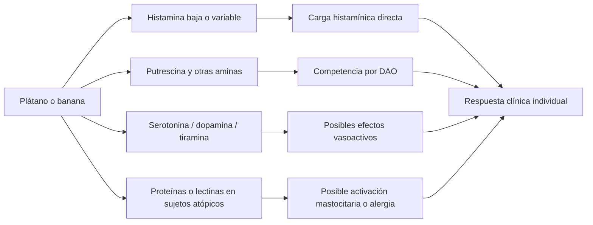

# Plátano y banana ante susceptibilidad a histamina elevada y actividad reducida de DAO

## Resumen ejecutivo

La conclusión más útil para la práctica clínica es esta: **el plátano/banana de mesa no encaja bien como alimento “inocuo” para personas con sospecha de intolerancia a la histamina o actividad reducida de DAO**, pero **tampoco se comporta como un alimento clásicamente “peligroso” por histamina** al nivel de pescados alterados, curados o fermentados. En una escala de 0 a 3, la **clasificación global más prudente** para la **pulpa fresca de banana/plátano de mesa** es **2/3 (riesgo moderado)**, con posibilidad de bajar a **1/3** en algunas personas cuando se prueba en pequeña cantidad y en fase clínica estable. La razón no es solo la histamina intrínseca, sino la combinación de **histamina variable**, **putrescina predominante** y otras aminas biógenas, junto con una tolerancia individual muy heterogénea. citeturn40view0turn43search3turn16view0turn26view0

La evidencia disponible **no demuestra que la banana inhiba directamente la DAO ni que induzca su actividad** en humanos. Lo que sí está documentado es un **efecto indirecto plausible**: la banana puede aportar **putrescina** —y en algunos estudios también cadaverina y tiramina—, aminas que comparten metabolismo con la DAO y pueden **ralentizar la degradación intestinal de histamina**. Además, el viejo concepto de “alimento liberador de histamina” sigue siendo **mecánicamente débil** y **no está bien probado en humanos**; para banana solo existe una pista experimental concreta con **BanLec** (lectina de banana) purificada, que activó mastocitos/basófilos en modelos experimentales y sujetos atópicos, pero esto **no equivale** a demostrar que una ración habitual de fruta desencadene ese fenómeno en clínica real. citeturn26view0turn40view0turn29view0

La madurez y el procesado **sí importan**, pero no de forma lineal ni uniforme entre variedades. En un estudio amplio de genotipos de banana y plátano macho, **histamina, tiramina, dopamina, serotonina, espermidina y espermina tendieron a bajar durante la maduración en la pulpa**, mientras que **la putrescina tendió a subir**; en varios plátanos de cocción, dopamina y serotonina bajaron hasta un estadio intermedio y luego repuntaron al sobremadurar. La **piel** concentró más **histamina y tiramina** que la pulpa. En cambio, un estudio analítico pequeño en banana comercial mostró **histamina medible** en fruta fresca y algo mayor tras 7 días de almacenamiento. Dicho de otro modo: **un plátano más maduro puede ser mejor por unas aminas y peor por otras**, y no hay base para convertir la madurez por sí sola en una regla absoluta. citeturn21search2turn35view0turn13view0turn23view1turn37search1

En la práctica, el plátano/banana debería manejarse como **“alimento de prueba”**: reintroducción gradual, en contexto estable, sin mezclarlo el mismo día con alcohol ni con otros alimentos claramente ricos en histamina, y registrando síntomas. Si la reacción es **inmediata**, con **prurito oral, hinchazón, urticaria, sibilancias o antecedente de alergia al látex**, el problema puede no ser DAO/histamina sino **alergia a banana** o **síndrome látex-fruta**; en ese escenario, la clasificación individual pasa a **3/3 hasta aclararlo**. La reintroducción dietética gradual y la interpretación clínica deben apoyarse en historia clínica y no en una única cifra de DAO sérica. citeturn48view0turn46search2turn46search0turn49view0

## Marco clínico y límites de la evidencia

La llamada “intolerancia a la histamina” sigue siendo una entidad clínica **discutida y difícil de demostrar** con biomarcadores robustos. Una revisión reciente sobre manejo dietético destaca que **no hay un biomarcador validado** y que el diagnóstico práctico sigue basándose en **síntomas compatibles**, **exclusión de otras causas** y **respuesta a dieta de eliminación/reintroducción**. La entity["organization","American Academy of Allergy Asthma & Immunology","allergy society"] resumió en 2023 un estudio con provocación placebo-controlada en 59 pacientes con sospecha de intolerancia a la histamina: **la sospecha quedó excluida en el 85%**, las reacciones al placebo fueron frecuentes y una DAO baja fue **solapante** con pacientes sin respuesta verdadera, por lo que **no resultó diagnóstica por sí sola**. citeturn45search0turn49view0

Esto importa mucho para interpretar cualquier “lista de alimentos prohibidos”. Las dietas bajas en histamina son **heterogéneas**: en la revisión comparativa más citada, solo los **alimentos fermentados** fueron excluidos de forma unánime; la banana apareció en el grupo de exclusión **intermedia** y su presencia en esas listas se explicó **más por otras aminas**, especialmente **putrescina**, que por histamina propiamente dicha. Esa misma revisión subraya que una gran parte de las exclusiones alimentarias actuales **no se justifica por contenido alto de histamina** y que las listas de “liberadores de histamina” siguen teniendo una base débil. citeturn23view0turn40view0

Desde el punto de vista toxicológico, la entity["organization","Autoridad Europea de Seguridad Alimentaria","eu food safety regulator"] consideró que, con la evidencia limitada disponible, **50 mg de histamina por comida** no causaban efectos adversos observables en personas sanas, mientras que **en pacientes con intolerancia a la histamina solo niveles por debajo del límite de detección podrían considerarse seguros**; para putrescina y cadaverina, la información fue insuficiente para fijar umbrales clínicos claros. Esto obliga a interpretar la banana no como “alta histamina” en sentido clásico, sino como un alimento de **riesgo contextual** cuando el paciente tiene **baja tolerancia** y **carga histamínica acumulada**. citeturn41search8turn41search22

## Contenido de histamina y otras aminas biógenas en plátano y banana

Como categoría alimentaria, la **fruta fresca** suele contener muy poca histamina: una base de datos del mercado español resumida en una revisión de 2020 informó para frutas una **media de 0,07 mg/kg** y un **máximo de 2,51 mg/kg**. Ese dato de fondo explica por qué, en términos generales, la fruta fresca no se clasifica junto a los alimentos histamínicos “clásicos”. Sin embargo, cuando se baja al alimento concreto banana/plátano, la literatura analítica muestra una **variabilidad bastante mayor** y, sobre todo, una carga relevante de **otras aminas**. citeturn43search3turn43search11

El estudio HPLC más útil para banana comercial accesible en texto completo detectó en **muestras frescas**: **putrescina 61,5 mg/kg**, **cadaverina 32,3 mg/kg**, **histamina 18,0 mg/kg**, **serotonina 25,4 mg/kg**, **tiramina 14,8 mg/kg**, además de espermidina, espermina, triptamina y feniletilamina. En ese trabajo, por tanto, la banana fresca no era “alta” en histamina al estilo tóxico alimentario clásico, pero sí exhibía una firma bioquímica de **carga amínica mixta** en la que la **putrescina dominaba claramente**. citeturn16view0turn23view1

Un estudio de maduración de banana **‘Prata’** encontró algo distinto: en ese cultivar se detectaron **putrescina, espermidina y serotonina**, pero no se informó de histamina ni tiramina en el resumen accesible. La **serotonina descendió significativamente** después del día 14 de almacenamiento y la **putrescina** se mantuvo similar hasta el día 21, bajando después. Esto sugiere que la composición amínica depende mucho del **genotipo**, la **fase de madurez** y probablemente del método analítico. citeturn13view0

La presencia de **serotonina, dopamina y norepinefrina** en banana está bien descrita desde hace décadas. Un resumen académico moderno que cita el trabajo clásico de 1958 sitúa en **pulpa de banana** aproximadamente **28 µg/g de serotonina**, **7,9 µg/g de dopamina** y **1,9 µg/g de norepinefrina**; otro estudio reportó un contenido muy alto de **dopamina en Cavendish**, incluso en fruta madura: **2,5–10 mg/100 g en la pulpa** y **80–560 mg/100 g en la piel**. Aunque estas aminas no equivalen a “histamina”, sí son **vasoactivas** y pueden ayudar a explicar por qué algunas personas refieren síntomas tipo cefalea, palpitaciones o rubor con una fruta que no siempre es histamínicamente alta. citeturn18search1turn19search8turn34view0

### Tabla comparativa de contenidos reportados

| Fuente | Muestra y base | Histamina | Otras aminas relevantes | Lectura clínica |
|---|---|---:|---|---|
| Revisión de alimentos del mercado español | Frutas en general, no específica de banana; base fresca | Media 0,07 mg/kg; máximo 2,51 mg/kg | No detallado aquí | Contexto: la fruta fresca suele ser baja en histamina, pero este dato no resuelve el caso concreto de banana/plátano. **Fuente:** revisión 2020 citeturn43search3turn43search11 |
| Estudio HPLC en banana comercial | Banana fresca; mg/kg peso fresco | 17,991 | Putrescina 61,502; cadaverina 32,313; tiramina 14,831; serotonina 25,379; espermidina 23,303; espermina 19,164; triptamina 10,344; feniletilamina 39,42 | Este es el mejor dato accesible de “banana fresca real”: la histamina existe, pero la **putrescina es la amina dominante**. **Fuente:** Tanasa 2015 citeturn16view0turn23view1 |
| Estudio de maduración en banana ‘Prata’ | Pulpa durante 35 días de almacenamiento | No especificado en el resumen accesible | **Detectadas:** putrescina, espermidina y serotonina; la serotonina bajó tras día 14 y la putrescina cayó después del día 21 | Perfil muy dependiente de variedad y madurez; no extrapolable sin cautela a Cavendish comercial. **Fuente:** Adão 2005 citeturn13view0 |
| Trabajo clásico de compuestos monoaminérgicos | Pulpa; µg/g | No especificado | Serotonina 28 µg/g; dopamina 7,9 µg/g; norepinefrina 1,9 µg/g | Confirma que la banana aporta **aminas vasoactivas** aun cuando no sea “alta histamina”. **Fuente:** resumen académico sobre Waalkes 1958 citeturn18search1 |
| Estudio en Cavendish | Pulpa y piel; mg/100 g | No especificado | Dopamina 2,5–10 en pulpa y 80–560 en piel, incluso madura | La **piel** es químicamente muy distinta de la pulpa y concentra más aminas. **Fuente:** Kanazawa 2000 citeturn19search8 |
| Poster de 20 genotipos de Musa | Pulpas y pieles; **mg/100 g de materia seca** | No se detallan cifras de histamina en el resumen accesible | Serotonina de pulpa 8,0–20,2; dopamina 26,5–38,1; en piel, dopamina hasta 643 y serotonina hasta 104 | Muy útil para **variedad** y **madurez**, pero no comparable directamente con estudios en peso fresco. **Fuente:** Proceedings 2018 citeturn20view0 |

La síntesis más prudente es, por tanto, que el plátano/banana **no es uniformemente bajo en todas las aminas relevantes**, y que usar solo el rótulo “alta” o “baja histamina” simplifica en exceso un alimento cuyo problema potencial parece residir más en su **perfil global de aminas** que en la histamina aislada. citeturn16view0turn40view0

## Efecto de madurez, almacenamiento, procesado y variedad

El trabajo comparativo más importante en **20 genotipos** de bananas y plátanos de cocción encontró que, en la **pulpa**, **histamina, tiramina, dopamina, serotonina, espermidina y espermina tendieron a disminuir con la maduración** en la mayoría de genotipos, mientras que **la putrescina aumentó**. En varios plátanos de cocción, dopamina y serotonina bajaron hasta el estadio 5 y luego repuntaron en estadio 7. Además, la **piel** contuvo niveles más altos de **serotonina, dopamina, histamina y tiramina** que la pulpa. Para una persona susceptible a histamina/DAO, esto sugiere que la maduración puede **desplazar el riesgo** desde monoaminas como serotonina/dopamina hacia una mayor relevancia relativa de **putrescina**, pero no lo elimina. citeturn21search2turn35view0

Los datos por variedad apoyan esa heterogeneidad. En el resumen del póster de 2018, **‘Yangambi’** y **‘Ouro da Mata’** mostraron los contenidos de **dopamina** más altos en fruta verde y madura; **‘Pelipita’** destacó por **serotonina**; y **‘D’Angola’** por dopamina elevada, sobre todo considerando también la piel. Esto significa que **“banana” no es una sola cosa** desde el punto de vista bioquímico: una Cavendish de supermercado, una banana de cocer o un plátano macho pueden compartir nombre común y tener **perfiles amínicos distintos**. citeturn20view0

El almacenamiento añade otra capa de variabilidad. En **‘Dwarf Cavendish’**, una semana a temperatura de refrigeración no produjo cambios importantes frente al almacenamiento minorista, pero a temperatura ambiente de laboratorio la **putrescina aumentó un 31,7%**, la **espermina un 225%** y la **histamina disminuyó un 18%**. En cambio, el estudio HPLC de banana comercial encontró que la **histamina subió** de 17,99 mg/kg en fresco a **25,27 mg/kg** tras 7 días a temperatura ambiente y a **28,05 mg/kg** tras 7 días en refrigeración. No son resultados totalmente coherentes entre sí, lo que probablemente refleja diferencias de cultivar, punto de partida, madurez inicial y método analítico. citeturn37search1turn37search13turn16view0turn23view1

Con el procesado ocurre algo parecido. En las bananas/plátanos estudiados experimentalmente, **boiling, microwaving y stir-frying** modificaron el contenido de aminas; en dos genotipos, **hervir con piel** aumentó la retención o incluso el contenido medido de serotonina y dopamina, y un extracto de citas del trabajo de 2019 señala que el **microondas sin piel en ‘Pelipita’** mostró un **aumento de histamina**. Para **congelado**, no se localizó un conjunto de datos banana-específico centrado en histamina/DAO; solo hay indicios indirectos de que la congelación afecta menos a serotonina que el hervido en frutas procesadas y una cita secundaria del trabajo de banana sugiere pérdidas de serotonina en banana congelada o en sorbete, pero **ese punto debe marcarse como no especificado para histamina**. citeturn20view0turn35view0turn34view0

### Tabla de variación por madurez, procesado y variedad

| Factor | Qué documenta la evidencia | Sentido probable del riesgo para histamina/DAO | Nivel de evidencia |
|---|---|---|---|
| Maduración en pulpa de muchos genotipos | Con la maduración, **histamina y tiramina tienden a bajar**, pero **putrescina tiende a subir**; en varios plátanos de cocción, dopamina/serotonina repuntan en sobremaduración. citeturn21search2turn35view0 | **Mixto**: puede mejorar por histamina/tiramina y empeorar por competencia con DAO vía putrescina. | Moderada |
| Banana ‘Prata’ | Solo se detectaron putrescina, espermidina y serotonina; la serotonina bajó tras el día 14. citeturn13view0 | Sugiere que algunas variedades son menos problemáticas por histamina, pero no demuestra inocuidad clínica. | Baja |
| Almacenamiento 7 días | Un estudio pequeño encontró **histamina más alta** tras 7 días; otro en Dwarf Cavendish halló **putrescina más alta** a temperatura ambiente y **histamina algo menor**. citeturn23view1turn37search1turn37search13 | **Incierto**, pero basta para no asumir que “guardar = igual”. | Baja |
| Piel frente a pulpa | La piel contiene **más histamina y tiramina** que la pulpa en muchos genotipos. citeturn21search2turn35view0 | Los productos con piel pueden ser **más problemáticos**. | Moderada |
| Cocción / microondas | La cocción modifica el perfil de aminas; se describió aumento de histamina en un genotipo tras microondas sin piel. citeturn20view0turn35view0 | Prudencia con preparaciones procesadas; no asumir que cocinar siempre “reduce riesgo”. | Baja |
| Congelado | **No especificado** para histamina/DAO de forma banana-específica en las fuentes revisadas. citeturn34view0turn35view0 | No puede clasificarse con seguridad. | Muy baja |
| Variedad | Hay variedades con pulpas o pieles especialmente ricas en dopamina/serotonina; Cavendish muestra dopamina muy alta en piel. citeturn20view0turn19search8 | La variedad puede modificar la tolerancia real del paciente. | Moderada |

## Mecanismos plausibles de reacción

La fisiología de base es clara: la histamina ingerida se degrada sobre todo por **DAO intestinal**, mientras que la **HNMT** es más relevante para histamina intracelular. El informe conjunto de la entity["organization","Organización de las Naciones Unidas para la Alimentación y la Agricultura","un food agency"] y la entity["organization","Organización Mundial de la Salud","un health agency"], así como revisiones modernas, coinciden en que la DAO es la barrera principal frente a la histamina dietaria y que esta enzima **también metaboliza otras aminas** como **putrescina** y **cadaverina**. citeturn8view3turn24search14turn48view0

El mecanismo **mejor documentado** para banana no es una supuesta “inducción/inhibición directa” de DAO por el fruto, sino la **competencia por sustrato**. Un estudio in vitro de 2022 mostró que **putrescina y cadaverina** enlentecen de forma significativa la degradación de histamina por DAO en todas las proporciones ensayadas; el efecto máximo apareció cuando estas aminas estaban 20 veces por encima de la histamina, reduciendo su degradación un **70–80%**, mientras que **tiramina** solo inhibió de forma significativa a la concentración más alta, con una reducción del **32–45%**. En la banana fresca analizada por HPLC, la **putrescina (61,5 mg/kg)** fue unas **3,4 veces** la **histamina (18,0 mg/kg)** y la **cadaverina** casi **1,8 veces**; esto **no prueba síntomas**, pero sí hace fisiológicamente plausible que, en un paciente con baja capacidad de degradación, la banana contribuya a una **carga amínica competitiva** más relevante que su histamina aislada. Esta última observación es una **inferencia** a partir de la combinación de ambos estudios. citeturn26view0turn16view0turn23view1

El mecanismo de “banana como liberador de histamina” es mucho más débil. La revisión crítica de dietas bajas en histamina deja claro que el mecanismo de tales “histamine-liberators” **no está elucidado** y que la revisión amplia de la literatura disponible concluía que **faltan estudios clínicos en humanos** que sostengan de forma convincente esa hipótesis. Por eso, llamar a la banana “liberadora de histamina” como si fuera un hecho establecido es **más fuerte de lo que permiten los datos**. citeturn40view0

La excepción parcial es una vía experimental concreta: la **lectina de banana** (**BanLec**) purificada de la pulpa. En un estudio en sujetos atópicos y no atópicos, BanLec produjo **35–40% de liberación de histamina** en leucocitos de atópicos, **26,7%** en mastocitos de rata, y su efecto se relacionó con niveles de IgE; además, los autores recuerdan que BanLec es una **proteína minoritaria** del fruto, alrededor de **4 mg/100 g** de porción comestible. Esto ofrece una **hipótesis biológica** para algunas reacciones idiosincrásicas o atópicas, pero está todavía muy lejos de demostrar que la banana corriente, en forma habitual de consumo, provoque liberación de histamina clínicamente relevante en la mayoría de pacientes con sospecha de DAO baja. citeturn29view0

Por último, una parte de las “reacciones a banana” puede no pertenecer al terreno histamina/DAO sino al de la **alergia**. Estudios clásicos documentaron reactividad cruzada con **látex**: en pacientes con alergia al látex se describieron síntomas con banana y pruebas cutáneas/IgE positivas. Si la reacción es **inmediata**, muy reproducible o se asocia a **prurito oral, edema o broncoespasmo**, hay que pensar en alergia mediada por IgE o síndrome látex-fruta antes que en intolerancia a la histamina. citeturn46search2turn46search0

El diagrama resume la interpretación más equilibrada de la literatura: **la banana rara vez es problemática por una sola vía**, y su tolerancia parece depender de la combinación entre **contenido amínico**, **capacidad DAO del paciente**, **atopia/alergia** y **momento clínico**. citeturn26view0turn40view0turn29view0turn46search2

## Síntesis de riesgo y clasificación

Para esta escala se adopta el siguiente sentido práctico: **0 = inocuo**, **1 = bajo riesgo**, **2 = riesgo moderado / alimento de prueba**, **3 = peligroso / no recomendable**. Aplicada a banana/plátano, la evidencia no justifica un **3/3 poblacional** por histamina alimentaria, porque una banana normal está muy lejos de las cargas histamínicas típicas de intoxicación y, en términos absolutos, la histamina por 100 g descrita en el estudio HPLC ronda **1,8 mg/100 g** en fresco. Sin embargo, tampoco justifica un **0/3**, porque la propia entity["organization","Asociación Dietética Británica","uk dietetic association"] recuerda que el diagnóstico se basa en tolerancia individual, que la DAO sérica no es definitiva y que otras aminas como putrescina y cadaverina pueden competir por su metabolismo; además, para individuos intolerantes la entity["organization","Autoridad Europea de Seguridad Alimentaria","eu food safety regulator"] advirtió que solo niveles **por debajo del límite de detección** podrían considerarse seguros. citeturn16view0turn41search8turn41search22turn48view0

La posición más defendible, por tanto, es **clasificar la banana/plátano de mesa fresco como 2/3 de manera global en pacientes susceptibles a histamina o con DAO reducida**, y modular ese valor según forma de consumo, madurez y antecedentes clínicos. La tiramina de una banana normal, con los datos disponibles, parece **menos importante** para la mayoría de pacientes que la putrescina: en el estudio de banana fresca fue aproximadamente **1,5 mg/100 g**, bastante por debajo de los niveles de preocupación que la EFSA menciona para personas en tratamiento con IMAO clásicos; por eso, fuera del contexto de IMAO, el eje más plausible sigue siendo **putrescina + histamina variable + susceptibilidad individual**, no la tiramina como actor principal. Esto último es una **inferencia razonada** a partir de la cuantificación del alimento y de los umbrales regulatorios. citeturn23view1turn41search8turn26view0

### Tabla de clasificación propuesta

| Escenario clínico y alimentario | Ranking 0–3 | Justificación principal | Nivel de evidencia |
|---|---:|---|---|
| **Banana/plátano de mesa fresco, pulpa, verde o amarillo temprano** | **1** | La fruta fresca en general suele ser baja en histamina y la maduración temprana puede implicar menos putrescina que fases posteriores; aun así, no es universalmente inocua. citeturn43search3turn21search2turn13view0 | Baja |
| **Banana/plátano de mesa fresco, pulpa, madurez habitual de consumo** | **2** | Hay histamina medible en algunas series y, sobre todo, putrescina claramente predominante, con plausibilidad de competencia por DAO. citeturn16view0turn26view0turn40view0 | Moderada |
| **Banana/plátano sobremaduro o almacenado varios días** | **2** | El almacenamiento y la sobremaduración alteran el perfil amínico; los datos son heterogéneos pero suficientes para no considerarlo “igual” que fresco. citeturn23view1turn37search1turn37search13 | Baja |
| **Plátano macho / banana de cocinar, o preparaciones con piel** | **2** | La piel concentra más histamina y tiramina que la pulpa; el procesado puede modificar aminas e incluso aumentar histamina en algunos genotipos. citeturn35view0turn20view0 | Baja a moderada |
| **Paciente con reacción inmediata reproducible, especialmente si hay alergia al látex o síntomas orales/respiratorios** | **3** | Aquí el problema puede ser alergia a banana o síndrome látex-fruta, no solo histamina/DAO; hasta aclararlo, es prudente considerarlo de alto riesgo individual. citeturn46search2turn46search0 | Moderada |
| **Clasificación global práctica para paciente con susceptibilidad a histamina/DAO reducida** | **2** | Mejor entenderlo como **alimento de prueba**, no alimento libre. citeturn40view0turn48view0turn49view0 | Moderada |

## Recomendaciones prácticas para pacientes y clínicos

La estrategia con mejor respaldo práctico sigue siendo una **eliminación temporal** de alimentos sospechosos y una **reintroducción gradual**. La guía profesional de la entity["organization","Asociación Dietética Británica","uk dietetic association"] propone, en sospecha clínica razonable, una fase de **2–4 semanas** seguida de reintroducción progresiva para definir tolerancias individuales. Dado que no se han localizado **ensayos de provocación específicos para umbral de banana/plátano**, lo más sensato es no tratar esta fruta como “permitida” ni como “prohibida” de forma universal, sino como un alimento a **testar individualmente**. citeturn48view0turn45search0

Para el paciente, la forma más prudente de reintroducirla es: **en fase estable**, **un solo cambio cada vez**, y preferiblemente con **pulpa sola**, evitando el mismo día alcohol, sobras, fermentados o otros alimentos claramente ricos en histamina. Si hay respuesta adversa, interesa distinguir **qué tipo de respuesta** fue: una clínica más lenta de cefalea, rubor, distensión, taquicardia o diarrea encaja mejor con fenómeno amínico/DAO; una reacción **inmediata** con picor oral, angioedema, urticaria franca, sibilancias o sensación de cierre faríngeo obliga a pensar en alergia y a suspender la prueba. citeturn48view0turn46search2turn46search0

En cuanto a la porción, **no hay dosis umbral validadas para banana** en este contexto. Como recomendación **conservadora e inferencial**, es preferible comenzar por una **pequeña cantidad** y aumentar en días separados solo si no hubo síntomas. La literatura apoya la reintroducción gradual, pero **no especifica cantidades estándar para banana**; por eso, el diario de síntomas, el contexto clínico y la carga histamínica del resto del día son más importantes que una cifra fija. citeturn48view0turn45search0

Para clínicos, la lectura útil es doble. Primero, **no sobrediagnosticar** por una DAO sérica aislada: el estudio placebo-controlado resumido por la AAAAI mostró que una DAO baja es **frecuente pero no diagnóstica**. Segundo, si la banana parece “culpable”, revisar si hay **fármacos que interfieran con DAO**, trastorno gastrointestinal subyacente, atopia, migraña sensible a aminas o antecedente de látex. Esa reevaluación suele tener más rendimiento que limitarse a listas fijas de alimentos. citeturn49view0turn48view0

Si se buscan **alternativas**, la mejor recomendación basada en la evidencia actual no es una “fruta universalmente segura”, porque las listas de alimentos tolerados son muy variables. Lo más razonable es elegir **una fruta fresca que el propio paciente ya haya tolerado repetidamente** y usarla como referente, en lugar de asumir que todas las frutas son equivalentes o que una lista externa sustituye la prueba individual. citeturn40view0turn48view0

Las **señales de alarma** que obligan a suspender el alimento y derivar para valoración alérgica urgente son: **hinchazón de labios o lengua, ronquera, sibilancias, disnea, urticaria extensa, mareo intenso o síncope**. En ese escenario, seguir hablando de “DAO” puede retrasar el diagnóstico correcto. citeturn46search2turn46search0

## Incertidumbres y referencias principales

Persisten varias incertidumbres relevantes. **No se localizaron estudios** que midan de forma directa si la banana **inhibe o induce la DAO** en humanos o en modelos de enterocito humano; la hipótesis mejor sustentada sigue siendo la **competencia indirecta por otras aminas**. Tampoco se hallaron **pruebas de provocación oral banana-específicas** en pacientes con sospecha de intolerancia a la histamina, ni datos directamente aplicables al **Plátano de Canarias** o a lotes comerciales concretos en España. A esto se suma un problema metodológico mayor: los estudios mezclan **peso fresco** y **peso seco**, **pulpa** y **piel**, múltiples cultivares y diferentes estados de madurez, de modo que los valores no son directamente intercambiables. citeturn45search0turn40view0turn21search2turn20view0

Los estudios que más falta hacen son muy concretos: **ensayos analíticos estandarizados** en pulpa comestible de cultivares comerciales españoles a varios grados de madurez; **estudios de provocación oral** con banana frente a placebo en pacientes fenotipados; y **modelos cinéticos de DAO** con matrices reales de banana que cuantifiquen cuánto pesan putrescina, cadaverina, tiramina y la propia histamina en la respuesta clínica. Hasta que existan esos datos, la recomendación honesta es clasificar la banana/plátano como un alimento de **riesgo moderado y muy individual** en histamina/DAO, no como un veredicto universal. citeturn26view0turn49view0turn40view0

Referencias principales:

- *Histamine Intolerance: The Current State of the Art*. Biomolecules, 2020. citeturn7search10turn23view0
- *Low-Histamine Diets: Is the Exclusion of Foods Justified by Their Histamine Content?* Nutrients, 2021. citeturn40view0
- *Biogenic Amines in Plant-Origin Foods: Are They Frequently Underestimated in Low-Histamine Diets?* Foods, 2018. citeturn43search1turn43search13
- *The Rate of Histamine Degradation by Diamine Oxidase Is Compromised by Other Biogenic Amines*. Frontiers in Nutrition, 2022. citeturn26view0
- *Bioactive amines changes during the ripening and thermal processes of bananas and plantains*. Food Chemistry, 2019. citeturn21search2turn35view0
- *Bioactive amines and carbohydrate changes during ripening of ‘Prata’ banana*. Food Chemistry, 2005. citeturn13view0
- *Separation and quantification of biogenic amines in bananas by high performance liquid chromatography*. Food and Environment Safety, 2015. citeturn23view1
- *Banana lectin (BanLec) induces non-specific activation of basophils and mast cells in atopic subjects*. European Annals of Allergy and Clinical Immunology, 2018. citeturn29view0
- *Placebo-Controlled Histamine Challenge Disproves Suspicion of Histamine Intolerance*. JACI: In Practice, 2023, resumido por la AAAAI. citeturn49view0
- *Intolerancia a la histamina como causa de síntomas digestivos crónicos en pacientes pediátricos*. Revista Española de Enfermedades Digestivas, 2013. citeturn10view1turn10view3